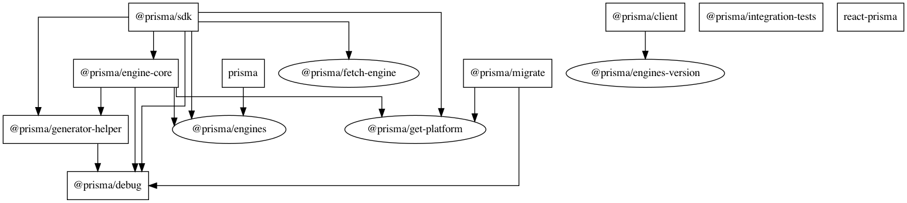
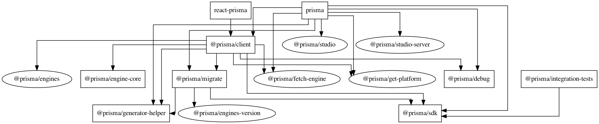
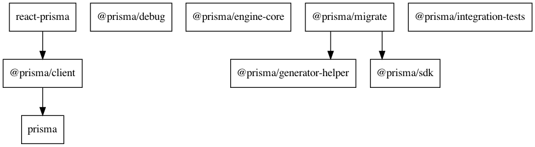

## Graphs

To Generate/Update install [GraphViz](http://graphviz.org/download/)

```
ts-node scripts/graph-dependencies.ts
```

### Dependencies



### Dev Dependencies



### Peer Dependencies



## Generators

See [Prisma Generators](https://prismaio.notion.site/Prisma-Generators-a2cdf262207a4e9dbcd0e362dfac8dc0)

## The `DMMF`, or Data Model Meta Format

What the ... is DMMF? It's the Datamodel Meta Format. It is an AST (abstract syntax tree) of the datamodel in the form of JSON.  
The whole Prisma Client is just generated based on the DMMF, which comes from the Rust engines.
Note: the datamodel is contained in the Prisma schema file, along the datasource and generators blocks.

> ⚠️ Note: The DMMF is a Prisma ORM internal API with no guarantees for stability to outside users. We might - and do - change the DMMF in potentially breaking ways between minor versions. 🐲

### Upgrading and debugging

<!-- TODO -->

Oftentimes, the Rust team did a change in DMMF, which you now need to integrate. How to do that?  
The first step is to identify, which new `@prisma/engines` version you want to use.  
Either have a look in the **Versions** tab in https://www.npmjs.com/package/@prisma/engines or check out `npm info @prisma/engines` in your terminal.  
Let's say you determined, that you want to upgrade to `2.20.0-14.f461292a2242db52d9f4c87995f0237aacd300d2`. To upgrade your local workspace, run this command to upgrade both `@prisma/engines` and `@prisma/engines-version`:

```bash
pnpm update -r @prisma/engines@2.20.0-14.f461292a2242db52d9f4c87995f0237aacd300d2 @prisma/engines-version@2.20.0-14.f461292a2242db52d9f4c87995f0237aacd300d2
```

In the `./packages/client` dir, now open [sandbox/dmmf.ts](./packages/client/sandbox/dmmf.ts) in your VSCode editor.
**Either** run `ndb` in your terminal to debug the file: `ndb -r ts-node/register ./sandbox/dmmf.ts`
**Or**

1. Open `.vscode/launch.json.default` and save it as `.vscode/launch.json`.
2. Then click on the debug icon in VSCode:
3. Then select in the dropdown of possible runner options `Client - Current TS File` 
4. Then just press the green play button
5. You should now be able to go through the DMMF and have a look at the json structure 

You can always check out the test of our "exhaustive schema", where we test the fully generated client, which depends on the dmmf:

```bash
pnpm run test exhaustive
```

Usually, dmmf changes are also visible in the tests of the `@prisma/internals` package:

```bash
cd ./packages/internal
pnpm run test
```

If there is a change in the snapshots, only accept them if you're 100% certain, that these changes are expected.  
If not, please always ping the Rust team, if this is an intended change.
