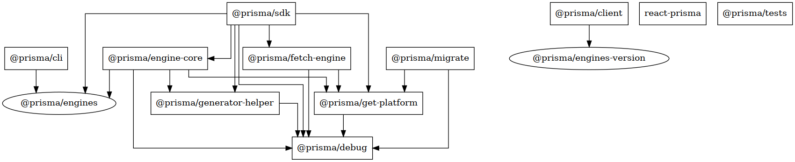
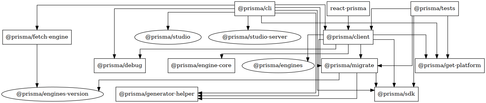
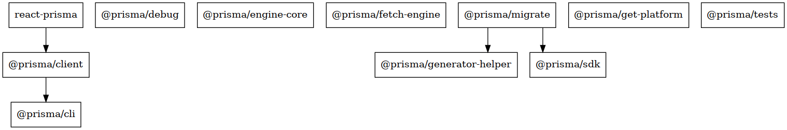

# Contributing

## Security

If you have a security issue to report, please contact us at [security@prisma.io](mailto:security@prisma.io?subject=[GitHub]%20Prisma%202%20Security%20Report%20) with as much details as possible so that it can be handled confidentially.

## Community

Prisma has a large and supportive [community](https://www.prisma.io/community) of enthusiastic application developers.
You can join us on [Slack](https://slack.prisma.io) and here on [GitHub Discussions](https://github.com/prisma/prisma/discussions).

## Bug Reports and Feature Requests

If you have found a **bug** or have a **feature request** then please create an issue in this repository (please search first in case a similar issue already exists).

## Testing

Want to write a test? Please have a look at our [TESTING.md](./TESTING.md).

## Code

Prisma consists of a mono-repo for all TypeScript code.
To setup and build the packages, follow these steps:

```bash
git clone https://github.com/prisma/prisma.git
npm i -g pnpm@6 --unsafe-perm
cd prisma/src
pnpm i
pnpm run setup
```

Note for Windows: Use the latest version of [Git Bash](https://gitforwindows.org/)

## General Prerequisites

1. Node.js `>=12.2` minimum, [latest LTS is recommended](https://nodejs.org/en/about/releases/)
1. Install [`yarn@1`](https://classic.yarnpkg.com/en/docs/install/) (for building a "pack" version of the client)
1. Install [`pnpm@6`](https://pnpm.js.org/) (for installing npm dependencies)
1. Install [`docker`](https://www.docker.com/products/docker-desktop) (for managing test databases)
1. Install [`ts-node`](https://github.com/TypeStrong/ts-node) (for running Node scripts written in TypeScript)

### Tips

1. Use [TablePlus](https://tableplus.com/) for managing sqlite database fixtures.

1. We use the [Jest test framework](https://jestjs.io/). Its CLI is powerful and removes the need for npm scripts mostly. For most cases this is what you need to know:

   ```
   yarn jest <fileNamePattern> -t <testNamePattern>
   ```

1. Some integration tests in these packages use [Jest's `each` feature](https://jestjs.io/docs/en/api#testeachtablename-fn-timeout). If you only want to run a subset of the test cases, simply leverage the `-t` flag on the command line (see above point). For example in `packages/cli` here is how you would run Just the `findOne where PK` cases for sqlite integration:

   ```
   yarn jest integrate.sqlite -t 'findOne where PK'
   ```

   Also you can piggy back flags onto existing npm scripts. For example the above could be rewritten as:

   ```
   yarn test:sqlite -t 'findOne where PK'
   ```

## Developing Prisma Client JS

1. `cd src/packages/client`
2. `ts-node fixtures/generate.ts ./fixtures/blog/ --skip-transpile`
3. `cd fixtures/blog`
4. `export DB_URL=YOUR_DATABASE_URL`  
   For this step you might find our [docker-compose setup](./src/docker) helpful
5. `npx prisma db push --skip-generate`
6. `ts-node main`

## Upgrading and debugging `DMMF`

What the ... is DMMF? It's the Datamodel Meta Format. It is an AST (abstract syntax tree) of the datamodel in the form of JSON.
The whole Prisma Client is just generated based on the DMMF, which comes from the Rust engines.
Oftentimes, the Rust team did a change in DMMF, which you now need to integrate. How to do that?
The first step is to identify, which new `@prisma/engines` version you want to use.
Either have a look in the **Versions** tab in https://www.npmjs.com/package/@prisma/engines or check out `npm info @prisma/engines` in your terminal.
Let's say you determined, that you want to upgrade to `2.20.0-14.f461292a2242db52d9f4c87995f0237aacd300d2`. To upgrade your local workspace, run this command to upgrade both `@prisma/engines` and `@prisma/engines-version`:

```bash
pnpm update -r @prisma/engines@2.20.0-14.f461292a2242db52d9f4c87995f0237aacd300d2 @prisma/engines-version@2.20.0-14.f461292a2242db52d9f4c87995f0237aacd300d2
```

In the `./src/packages/client` dir, now open [sandbox/dmmf.ts](./src/packages/client/sandbox/dmmf.ts) in your VSCode editor.
**Either** run `ndb` in your terminal to debug the file: `ndb -r ts-node/register ./sandbox/dmmf.ts`
**Or**

1. Open `.vscode/launch.json.default` and save it as `.vscode/launch.json`.
2. Then click on the debug icon in VSCode:
3. Then select in the dropdown of possible runner options `Client - Current TS File` 
4. Then just press the green play button
5. You should now be able to go through the DMMF and have a look at the json structure 

You can always check out the test of our "exhaustive schema", where we test the fully generated client, which depends on the dmmf:

```bash
pnpm run test exhaustive
```

Usually, dmmf changes are also visible in the tests of the sdk:

```bash
cd ./src/packages/sdk
pnpm run test
```

If there is a change in the snapshots, only accept them if you're 100% certain, that these changes are expected.
If not, please always ping the Rust team, if this is an intended change.

### Integration tests

We have two kinds of integration tests:

1. Testing basic query functionality - located in [`src/integration-tests/src/__tests__/integration`](./src/packages/integration-tests/src/__tests__/integration)
2. Testing the client in mini projects - located in [`src/client/src/__tests__/integration`](./src/packages/client/src/__tests__/integration)

To run any of these, start the test databases (see [readme](./src/docker) for various ways to run these)

1. `cd src/docker`
1. `docker-compose up -d`

#### General client integration tests (`./integration-tests`)

The integration tests consisting of mini project are located in [`src/integration-tests/src/__tests__/integration`](./src/packages/integration-tests/src/__tests__/integration)

Start the tests

1. `cd src/packages/integration-tests`
2. `pnpm run test`

#### Prisma Client folder-based integration tests (`./client`)

The integration tests consisting of mini project are located in [`src/client/src/__tests__/integration`](./src/packages/client/src/__tests__/integration)

Start the tests

1. `cd src/packages/client`
2. `pnpm run test integration`

Notes:

- To update the snapshots run script with Yarn and add `-u` flag like this: `yarn run test -u`
- If on a patch branch then the latest engine binary patch version for that semver-minor series will be used. If not on a patch branch then the current `master` engine binary version will be used. A patch branch is a branch whose name matches semver pattern `2.<minor>.x`. The Test suite will log which engine binary is being used at the start of testing.

#### Creating a new integration test

Prisma Client JS integration tests are located in https://github.com/prisma/prisma/tree/master/src/packages/client/src/__tests__/integration
If you want to create a new one, we recommend to copy over the [minimal test](https://github.com/prisma/prisma/tree/master/src/packages/client/src/__tests__/integration/happy/minimal) and adjust it to your needs.
It will give you an in-memory Prisma Client instance to use in the test. It utilizes the [`getTestClient`](https://github.com/prisma/prisma/blob/f1c2c5d4c02fcd2cba9e10eaa0a5bbde371818ca/src/packages/client/src/utils/getTestClient.ts#L23) helper method.

Sometimes you need an actual generated Client, that has been generated to the filesystem. In that case your friend is [`generatedTestClient`](https://github.com/prisma/prisma/blob/f1c2c5d4c02fcd2cba9e10eaa0a5bbde371818ca/src/packages/client/src/utils/getTestClient.ts#L59). An example that uses this helper is the [blog example](https://github.com/prisma/prisma/tree/master/src/packages/client/src/__tests__/integration/happy/blog)

### Debugging a local project with your custom Prisma Client (aka `yarn link`)

If you want to debug a project that you have on your local dev machine and run it with your local Prisma Client, we have something for you ;)
The Prisma Client JS core authors need this all the time to debug projects, especially if databases like Postgres or MySQL are involved.

<details>
  <summary>Click to expand</summary>

Let's say your project that uses Prisma Client is located in `~/reproduction/repro1`. We got this fresh reproduction from a support engineer or a Prisma user.

1. If you did not already, please go into `./src/packages/client` in your terminal.
2. The magic script is located in `fixtures/generate.ts`. It has a couple of different modes in which it can run, depending on your needs.

#### Basic Usage: `ts-node fixtures/generate.ts ~/reproduction/repro1`

If you execute `ts-node fixtures/generate.ts ~/reproduction/repro1`, a Prisma Client will be generated to `~/reproduction/repro1/node_modules/.prisma/client` and `~/reproduction/repro1/node_modules/@prisma/client`.
It is the nearest it gets to a "production" environment, in which it uses `npm pack` of your local `client` package. That means if you want to see any change in this approach, you need to run `yarn build` every time, before you re-generate the client for your reproduction project.
Although `yarn build` is already quite quick, we might even have something faster for you:

#### Faster iterations (TS only): `ts-node fixtures/generate.ts ~/reproduction/repro1 --skip-transpile`

In this case, we're not generating the Prisma Client as usual into `./project/node_modules/@prisma/client` but just to `./project/@prisma/client`.
That means in your project you need to change the import. What is the advantage of this approach? You don't need to run `yarn build` every time you have a change.
Note however, that this **just works with TypeScript**, as that client in `./@prisma/client` directly imports the runtime from the `./src/runtime/` dir in your local client code.
You will need to have a `tsconfig.json` in that project, with strict mode disabled. You can [use the one of the blog fixture project](./src/packages/client/fixtures/blog/tsconfig.json).

#### Faster iterations (also JS): `ts-node fixtures/generate.ts ~/reproduction/repro1 --skip-transpile --built-runtime`

There are also cases, in which you still want faster iterations, but have a JavaScript example and don't want to port it to TypeScript.
In this case, you can still do `yarn build`, but you don't need to rerun `ts-node fixtures/generate.ts ...` all the time.
It will be a client, that again gets generated to `./project/@prisma/client` (note that the node_modules is intentionally missing here) and points to the already built runtime dir in `./runtime` in the client code.

With these 3 options you should be able to tackle any bug in any reproduction you get :)
Note, that sometimes you need to debug bugs in the [`engine-core`](./src/packages/engine-core/) package.
You'll need to build `engine-core` with `yarn build` if you want that change to end up in the reproduction project.

</details>

### Code generation

#### Working on code generation

If you have your local blog fixture running, you can now do changes to `TSClient.ts` and re-execute `npx ts-node fixtures/generate.ts ./fixtures/blog/`.

When doing changes and working on a fixture use `yarn build && rm -rf fixtures/blog/node_modules/ && ts-node fixtures/generate.ts fixtures/blog`

### Runtime

#### Working with the runtime

If you want to use the local runtime in the blog fixture, run

```sh
ts-node fixtures/generate.ts ./fixtures/blog/ --skip-transpile
```

Changes to `query.ts` will then be reflected when running `fixtures/blog/main.ts`

## ENV Variables for debugging

| ENV                                | Info                                     |
| ---------------------------------- | ---------------------------------------- |
| FORCE_PANIC_MIGRATION_ENGINE=1     | Forces the Migration Engine to Panic     |
| FORCE_PANIC_INTROSPECTION_ENGINE=1 | Forces the Introspection Engine to Panic |

## Migrate

### Developing Prisma Migrate

1. `cd src/packages/migrate/fixtures/blog`
1. `ts-node ../../src/bin.ts dev`

### Developing `prisma init` Command

1. `cd src/packages/introspection`
1. `mkdir test && cd test`
1. `ts-node ../src/bin.ts`

### Developing `prisma` CLI

1. `cd src/packages/cli`
1. `mkdir test && cd test`
1. `ts-node ../src/bin.ts generate`

## Running the Databases locally with Docker Compose

```bash
cd src/docker
docker-compose up -d
docker-compose logs -f app
```

## Git Commit Messages

We structure our messages like this:

```
<type>(<package>): <subject>
<BLANK LINE>
<body>
```

Example

```
feat(client): new awesome feature

Closes #111
```

List of types:

- feat: A new feature
- fix: A bug fix
- docs: Documentation only changes
- style: Changes that do not affect the meaning of the code (white-space, formatting, missing semi-colons, etc)
- refactor: A code change that neither fixes a bug nor adds a feature
- perf: A code change that improves performance
- test: Adding missing or correcting existing tests
- chore: Changes to the build process or auxiliary tools and libraries such as documentation generation

List of packages:

- cli
- client
- debug
- engine-core
- generator-helper
- migrate
- react-prisma
- sdk
- tests

## Graphs

To Generate/Update install [GraphViz](http://graphviz.org/download/)

```
cd src
ts-node scripts/graph-dependencies.ts
```

### Dependencies



### Dev Dependencies



### Peer Dependencies



## Legal

Pull Request authors must sign the [Prisma CLA](https://cla-assistant.io/prisma/prisma), it will show up in an automated comment after you create a PR.

If you cannot or do not want to sign this CLA (e.g. your employment contract for your employer may not allow this), you should not submit a PR.
Open an issue and someone else can do the work.
