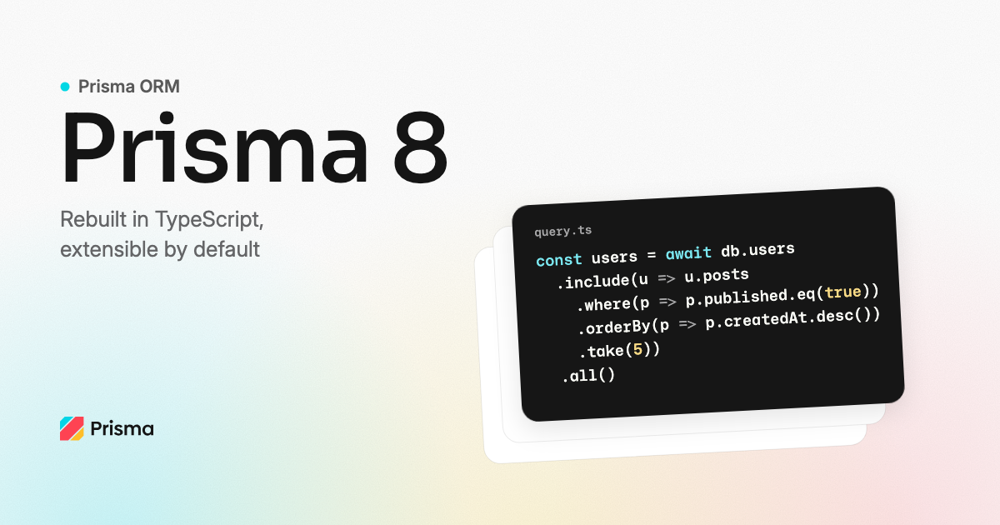

<p align="center">
  <a href="https://github.com/prisma/prisma">
    
  </a>
</p>

<p align="center">
  <a href="https://pris.ly/discord">Discord</a>  |  <a href="https://twitter.com/prisma">X</a>  |  <a href="https://pris.ly/pn-announcement">Blog Post</a>  |  <a href="./ARCHITECTURE.md">Architecture</a>
</p>

<p align="center">
  <a href="./LICENSE"></a>
  <a href="https://www.npmjs.com/package/@prisma/cli"></a>
  <a href="https://github.com/prisma/prisma/actions/workflows/ci.yml"></a>
</p>

---

> **Looking for Prisma ORM 7?** It lives on the [`v7` branch](https://github.com/prisma/prisma/tree/v7) of this repository, and the `prisma` and `@prisma/*` packages on npm continue to be published from there.

> **Prisma Next is currently in [Early Access](https://pris.ly/pn-ea)** and we're building it in the open with the community. APIs will still evolve as your feedback shapes them, so we don't recommend it for production workloads yet. Come along for the ride: star the repo, follow [@prisma on X](https://pris.ly/x), or read along on the [Prisma blog](https://www.prisma.io/blog).

**Prisma Next** is a TypeScript rewrite of Prisma ORM, designed to be **extensible**, **composable**, and **AI-agent friendly** by default. Read the full announcement: [The Next Evolution of Prisma ORM](https://pris.ly/pn-announcement).

## Prerequisites

- Node.js 24 or newer
- A package manager (`npm`, `pnpm`, or `yarn`)

## Getting started

### 1. Scaffold a new project

The interactive scaffolder picks a JavaScript framework (Next.js, Vite, Hono, and others) and wires Prisma Next in with your chosen database (PostgreSQL or MongoDB):

```bash
npm create prisma@next
```

You finish with a runnable app, a starter contract, and the agent skills already registered.

### 2. Or, add Prisma Next to an existing project

Run this from your repo root:

```bash
npx @prisma/cli@next orm init
```

`prisma orm init` writes `prisma.config.ts`, scaffolds a starter contract and `db.ts` under `src/prisma/`, installs the runtime, emits the contract, and registers the agent skills. It does not touch your framework or build setup.

### 3. Use your AI agent for everything Prisma Next

Both installers leave a top-level **`prisma-next.md`** primer at your project root for any agent to read first. `init` additionally materialises one **`SKILL.md`** per workflow in two places, so different agent runtimes can find them at their expected paths:

- `.claude/skills/<skill-name>/SKILL.md` — picked up by Claude Code
- `.agents/skills/<skill-name>/SKILL.md` — universal location for Cursor, Copilot Agent, and other runtimes

A `skills-lock.json` at the project root tracks which skill versions are installed. Your editor's AI assistant auto-loads the right skill when your prompt matches.

Just describe what you want. For example:

> *"Add a `posts` model with a relation to `users`, then write a query that loads each user's three most recent posts."*

The agent loads the `prisma-8` skill, opens its contract and queries references, then drives the change end-to-end.

For the full catalogue and what each skill covers, see [`skills/README.md`](./skills/README.md).

## Found a bug, missing a feature, or have a question for the team?

Ask your agent. The `prisma-8` skill's feedback flow drafts a structured GitHub issue or hands you a Prisma Discord link for live Q&A. You can review and confirm before anything is submitted.

## For extension authors

Prisma Next has a minimal core. Everything around it, including Postgres support itself, is built on the same public SPI that's available to any author. If you've wanted to integrate your tool, your database, or your library with Prisma, this is the way in.

A few extensions already shipping:

- **`@internal/extension-pgvector`**: vector columns and similarity operators for semantic search.
- **`@internal/extension-paradedb`**: typed BM25 indexes with multiple tokenizers for full-text search.
- **`@internal/extension-postgis`**: geospatial types and queries.
- **[`@cipherstash/prisma-next`](https://pris.ly/cipherstash-p-blog)**: searchable encryption and data-level access control.

Want to ship your own? The **[Authoring Prisma Next Extensions](https://pris.ly/pn-extension-authors)** blog walks through the SPI, the layers your extension can hook into, and how the team features new extensions in the Prisma Next directory.

## Supported databases

Prisma 8 carries **PostgreSQL to general availability** — and that is all at this stage:

- **PostgreSQL** — the primary target; general availability at Prisma 8
- **MongoDB** — early access; proves the framework works beyond SQL
- **SQLite** — a proof of concept today

MySQL follows later. See the [roadmap](./ROADMAP.md) for what must happen before the 8.0.0-rc.1 release.

## Contributing

See [CONTRIBUTING.md](./CONTRIBUTING.md) for setup, commands, DCO signoff, and PR expectations. For substantive changes, please open an issue first so we can give direction-fit feedback before you invest implementation time.

Security issues: follow the Private Vulnerability Reporting flow in [SECURITY.md](./SECURITY.md). Please do not file them as public issues.

## Community

Built something with Prisma Next? Tag [@prisma](https://pris.ly/x) on X. The best community builds get a shout-out and a link here.

- **Discord**: Talk to us in [Discord](https://pris.ly/discord) in the `prisma-next` channel
- **X**: [@prisma](https://pris.ly/x)
- **Blog**: [prisma.io/blog](https://www.prisma.io/blog)

## License

Apache 2.0. See [LICENSE](./LICENSE).
