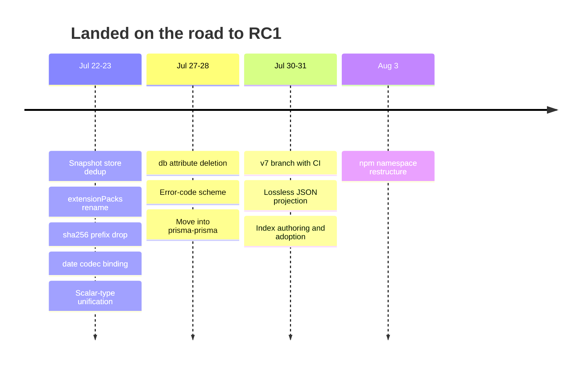

# Roadmap to Prisma 8 RC1

Prisma Next — the contract-first rewrite of Prisma — ships as **Prisma 8**. On **July 31** we publish **`prisma@8.0.0-rc.1`** from the `prisma/prisma` repository: the same repository and the same npm package Prisma users already know. The release candidate is published under a pre-release tag, so `npm install prisma` keeps installing Prisma 7 until 8.0.0 final ships. Prisma 8 carries **PostgreSQL to general availability** — and that is all: **MongoDB ships in early access**, and **SQLite is a proof of concept** at this stage. A release candidate freezes the public API; it does not promise Prisma 7 feature parity. Its promise is different: **everything it ships works and is proven by a test**, everything experimental is labeled, and everything absent is named rather than silently missing.

**Updated August 5 · Health: on track · Ships July 31 · Tasks: 14 done / 9 in flight / 21 not started · [Scoreboard](scorecard.md): 416 proven / 488 unproven / 12 experimental / 244 not in 8.0**

## What needs to happen to release v8-RC1

Six things must be true on release day. Everything on this page belongs to one of them.

1. **[Queries must return correct values](#1-queries-must-return-correct-values)** — *in progress · Alexey.* The relation-loading codec defect is fixed and verified, and aggregates now decode through codecs; two type/runtime mismatches remain.
2. **[The schema language must reach its final form](#2-the-schema-language-must-reach-its-final-form)** — *in flight · Serhii.* Whatever syntax the RC ships is permanent for the life of v8; three language projects are running.
3. **[Every name and format users depend on must be final](#3-every-name-and-format-users-depend-on-must-be-final)** — *in progress · Will.* Error codes, hashes, the migration snapshot layout, and the config-key rename are done; the `prisma-next` name sweep remains.
4. **[The release's claims must be proven](#4-the-releases-claims-must-be-proven)** — *scoreboard drafted, proofs open · everyone.* "It works" and "you can migrate incrementally" each need a runnable receipt.
5. **[The code must move into prisma/prisma](#5-the-code-must-move-into-prismaprisma)** — *in progress · Alexey.* The code is in prisma/prisma and the `v7` branch runs its own CI; the package-name takeover and the v7 issue triage remain.
6. **[The rough edges users hit on day one must be gone](#6-the-rough-edges-users-hit-on-day-one-must-be-gone)** — *not started · everyone.* Small fixes that would be embarrassing under announcement-day attention.

One dated decision still bounds the work: the polymorphism stable-or-experimental call (July 24, decided by whether its bug stream has flattened). Two are already made. The minimum supported Postgres version is **15**, decided August 11 ([ADR 248](docs/architecture%20docs/adrs/ADR%20248%20-%20PostgreSQL%20floor%20lowered%20to%2015.md)) — CI already runs `postgres:15` in every job, so the floor now matches what we test, and the scoreboard verdicts it was blocking are unblocked. And error codes standardize on dotted namespace codes (like `ORM.DECODE_FAILED`), with the consolidation landed. July 24 is also the day the scoreboard verdicts freeze and scope stops moving. There is no other internal schedule: we work these sections as fast as they'll go and ship when they're done.

---

## 1. Queries must return correct values

Prisma 8's core promise at the RC is that the query paths it ships are correct. The one significant defect class — relation-loading bypassing type codecs — is fixed as of July 31, and aggregate decoding followed on August 5; what remains is the type/runtime mismatches and the polymorphism call.

✅ <b>Values read through relation-loading bypass their type codecs — big numbers silently corrupt, date columns throw</b> · landed

When a query loads a relation (say, a post together with its author), Postgres assembles the nested rows into JSON inside the database, using its `json_agg` function. JSON numbers cannot represent everything a database column can hold: a 64-bit integer or arbitrary-precision decimal got silently rounded to the nearest JavaScript-representable number before Prisma's type codecs ever saw it, and date/time values arrived in a format the decoder rejects — so a plain `DateTime` column read through `.include()` threw.

The fix landed July 31: every type codec states an explicit *lossless* canonical JSON form (big numbers travel as decimal strings, binary as base64), and the SQL we generate produces that form inside the database. It shipped as three pull requests in strict sequence — the projection AST foundations ([TML-3062](https://linear.app/prisma-company/issue/TML-3062), [#1023](https://github.com/prisma/prisma-next/pull/1023)), the per-database codec descriptors ([TML-3061](https://linear.app/prisma-company/issue/TML-3061), [#1051](https://github.com/prisma/prisma-next/pull/1051)), and the switch-over carrying the per-codec projections and their database-backed conformance harness ([TML-3100](https://linear.app/prisma-company/issue/TML-3100), [TML-3063](https://linear.app/prisma-company/issue/TML-3063), [#29844](https://github.com/prisma/prisma/pull/29844)). The switch-over is the promised breaking change: users regenerate their contract files, nine codecs change their JSON form on the read path, and zone-less timestamps now read as UTC. Integration tests prove each renderer produces the canonical form against a real database.

One remainder was accepted knowingly and later closed: aggregate values now decode through codecs ([TML-3064](https://linear.app/prisma-company/issue/TML-3064), landed August 5 as [#29867](https://github.com/prisma/prisma/pull/29867)). The other stands: `pg/geometry@1` keeps its non-canonical form until its SRID representation is decided and a PostGIS-capable test database exists ([TML-3105](https://linear.app/prisma-company/issue/TML-3105)).

✅ <b>`date` columns fail at runtime when read through relation-loading</b> · landed

The codec that correctly handles Postgres `date` values exists and is strict (it rejects impossible dates like February 31st rather than silently normalizing them), but nothing connected the `date` column type to it — so reading a `date` column through `.include()` threw at decode time, because the column inherited the `timestamptz` codec, which rejects the bare `YYYY-MM-DD` that `json_agg` renders. `@db.Date` now binds to `pg/date@1`, and a test proves an included `date` column comes back as a `Date` ([TML-3086](https://linear.app/prisma-company/issue/TML-3086), landed as [#1038](https://github.com/prisma/prisma-next/pull/1038)).

✅ <b>Binary columns read through relation-loading return hex text instead of bytes</b> · landed

Same disease as the big one above, concrete instance: a `Bytes` column selected inside `.include()` came back as the raw hexadecimal text Postgres uses in JSON (`\x48656c6c6f`) while the TypeScript types promise a `Uint8Array`. Fixed by the lossless-JSON switch-over: `pg/bytea@1`'s canonical JSON form is base64, and an integration test reads an included `bytea` column back as its exact bytes ([TML-2990](https://linear.app/prisma-company/issue/TML-2990), landed as part of [#29844](https://github.com/prisma/prisma/pull/29844)).

⏳ <b>Places where the TypeScript types and the runtime disagree</b>

Two known mismatches remain, both "the type signature promises one thing, the running code returns another":

- `Timestamp`/`Timestamptz` columns: the declared output type is a branded string, but the codec actually returns a JavaScript `Date` ([TML-2391](https://linear.app/prisma-company/issue/TML-2391), in progress).
- Projects that use the schema types directly without running contract emission (`typeof contract`) get types that ignore per-instance codec parameters — enum value sets are fixed ([TML-2960](https://linear.app/prisma-company/issue/TML-2960), [#958](https://github.com/prisma/prisma-next/pull/958)), the codec-parameter half is tracked as [TML-3014](https://linear.app/prisma-company/issue/TML-3014).

A third is resolved: aggregate values now decode through target-declared aggregate codecs, so the type an aggregate declares is the value the runtime hands back. `count()` reads as a `number` and refuses a tally outside ±(2^53 − 1) rather than rounding it, with `countBigInt()` as the lossless form. Delivered with the public target testkits for extensions ([TML-3064](https://linear.app/prisma-company/issue/TML-3064), landed August 5 as [#29867](https://github.com/prisma/prisma/pull/29867)); the native-number defaults are [TML-3165](https://linear.app/prisma-company/issue/TML-3165).

A type that lies is a correctness bug with a delay on it; all must be resolved (or the type corrected to tell the truth) before the types freeze.

⏳ <b>Finish the polymorphism bug tail — then decide: stable or experimental</b>

Polymorphism means models that inherit from a base model, stored across joined tables (multi-table inheritance). It has been the source of most of Prisma 8's recent correctness bugs. The encouraging signal: recent fixes are narrow edge cases rather than missing capabilities, and no known-broken or skipped tests remain in the area. The open list, so the tail is visible rather than vibes:

- Explicit `.select(...)` on a polymorphic include doesn't restrict variant-table columns ([TML-2783](https://linear.app/prisma-company/issue/TML-2783) — the runtime fix landed in [#984](https://github.com/prisma/prisma-next/pull/984); the typed `.select()` surface still offers base-model fields only).
- Variant lookup is namespace-flat, so two variants with the same name in different namespaces can't be addressed ([TML-2841](https://linear.app/prisma-company/issue/TML-2841), in progress).
- The model accessor's return type isn't variant-aware ([TML-2847](https://linear.app/prisma-company/issue/TML-2847), in progress).
- The shorthand `.where({priority: 1})` form rejects variant fields that the callback form accepts ([TML-2982](https://linear.app/prisma-company/issue/TML-2982), open).
- Bulk `createAll()` on a variant silently drops write annotations ([TML-2600](https://linear.app/prisma-company/issue/TML-2600), open).
- A variant model declaring a column that collides with a base-table column silently merges instead of failing validation ([TML-2827](https://linear.app/prisma-company/issue/TML-2827), open).

On July 24 we decide from this list and the discovery rate, not from hope: if it's shrinking and nothing new is appearing, polymorphism ships inside the stability promise; otherwise it ships clearly labeled experimental and stabilization continues after the RC without blocking it.

---

## 2. The schema language must reach its final form

Users write their data model in Prisma Schema Language (PSL) files. Whatever syntax the RC accepts is the syntax v8 supports forever — so every planned change to the language must land before July 31 or be abandoned. Four language changes are planned — mixins, native column types, directional relations, and tagged SQL fences — plus one item that follows from them: removing `@dbgenerated()` builds on the tagged fences.

⏳ <b>Mixins: reusable, named sets of fields</b>

The long-standing ask — share `createdAt`/`updatedAt`/tenant-id fields across many models without copy-paste — gets a first-class answer: define the fields once in a named `mixin` block, include them with `@@include(WithTimestamps)`. Mixins deliberately take no parameters (variations get their own names), and they replace two existing mechanisms that grew complicated trying to solve the same problem: *field presets* (pack-shipped field templates with an argument system) and *type aliases*. Both retire.

Decided by the team on July 20; design in progress. Tracked as [TML-3055](https://linear.app/prisma-company/issue/TML-3055/psl-mixins-named-field-set-reuse-retire-field-presets-type-aliases-and). This is the largest single pre-release work item.

✅ <b>Native column types move onto type constructors; `@db.*` attributes are deleted</b> · landed

Prisma 7 spelled database-native column types with attributes: `email String @db.VarChar(255)`. Prisma 8 replaces that spelling with the type written directly in the type position: `email VarChar(255)`, `id Uuid`, `payload Jsonb`. The type says what the column is; no attribute needed. All `@db.*` attribute support is deleted from the language before the freeze — shipping both spellings would freeze both forever.

Both halves have landed. The scalar-type unification — every scalar becomes a zero-argument type constructor under one contribution mechanism, with the Postgres native constructors exposed — landed first ([TML-2986](https://linear.app/prisma-company/issue/TML-2986), [#1022](https://github.com/prisma/prisma-next/pull/1022)). The `@db.*` channel itself is now deleted ([TML-2988](https://linear.app/prisma-company/issue/TML-2988), landed as [#1054](https://github.com/prisma/prisma-next/pull/1054)): writing a `@db.*` attribute fails with a diagnostic that spells out the replacement, e.g. `@db.Uuid is no longer supported; use Uuid in type position`. Only the bare-type spelling survives the freeze.

⏳ <b>Relations get a directional spelling; `@relation(name:)` retires</b>

Prisma 7 expressed relations with paired fields on both models and disambiguated with `@relation(name: "...")` strings — a spelling users routinely get wrong. Prisma 8 replaces it with directional syntax: a foreign key declares where it points (`from`/`to`), many-to-many goes through an explicit junction (`through: Junction`) or an implicit one synthesized for you, and multi-hop paths spell the route out (`a -> J.b -> J.c -> T.d`). Five slices, all in flight ([TML-2940](https://linear.app/prisma-company/issue/TML-2940) through [TML-2944](https://linear.app/prisma-company/issue/TML-2944)). This is frozen-surface work on exactly the same clock as mixins: whatever relation spelling the RC accepts is the spelling for the life of v8.

⬜ <b>SQL embedded in schemas gets proper fences instead of escaped strings</b>

Schemas sometimes need to carry a piece of literal SQL: a view definition, a partial-index condition, a row-level-security policy expression, a database-computed default. Today those travel as ordinary quoted strings, with all the escaping pain that implies. The accepted design ([ADR 129](docs/architecture%20docs/adrs/ADR%20129%20-%20Template-Tagged%20Literals%20for%20Extensions.md)) is a tagged backtick fence — `` pg.sql`SELECT 1` `` — with no string interpolation, cleanly handed to the extension that owns it. It is not implemented yet; if it doesn't land, the quoted-string form freezes as the API.

⬜ <b>`@dbgenerated()` is removed; database-computed defaults become tagged fences</b>

Prisma 7 spelled "the database computes this default" as an attribute wrapping a SQL string: `@default(dbgenerated("gen_random_uuid()"))` — a quoted string with escaping problems and no ownership story. Prisma 8 removes `@dbgenerated()` entirely: a raw SQL default is written as a tagged backtick fence (the mechanism above), so the same one syntax carries every piece of embedded SQL in a schema. This depends on the tagged-fence implementation landing first. It also reaches beyond the parser: the Postgres and SQLite default-handling code and the introspection path (which meets `dbgenerated`-shaped defaults in every real existing database, and must *emit* tagged fences for them) all change with it.

---

## 3. Every name and format users depend on must be final

Users write `catch` blocks against error codes, commit generated contract and migration files to their repositories, and write config files against our keys. All of that becomes permanent API at the RC. Six changes must land first — sequenced together, because several of them alter the same generated files and users should see one change, not six.

✅ <b>One error-code scheme instead of four</b> · landed

Prisma 8 grew four separate error systems with two incompatible code formats — about 46 codes shaped like `PN-CLI-4001` and about 89 shaped like `RUNTIME.DECODE_FAILED` — plus roughly sixteen error classes carrying no code at all. That's over: every published error is now a structural envelope with a dotted `NAMESPACE.SUBCODE` code, recognized by a type predicate instead of `instanceof` ([TML-3067](https://linear.app/prisma-company/issue/TML-3067)); the ORM's and the contract-authoring plane's formerly codeless throws carry structured `ORM.*` / `CONTRACT.*` codes ([TML-3070](https://linear.app/prisma-company/issue/TML-3070), [TML-3075](https://linear.app/prisma-company/issue/TML-3075)); and the reference page documenting all 221 published codes ships in-repo with a CI check that fails any change adding an undocumented code ([TML-3071](https://linear.app/prisma-company/issue/TML-3071)). The old→new crosswalk is published in ADR 239 and feeds the v8 upgrade guide. What continues after the freeze is non-breaking by construction: sweeping the adapter and extension planes' remaining codeless throws onto the same scheme only *adds* codes. Prisma 7's `P1001`-style codes are deliberately not carried over — the upgrade guide will include a translation table for migrating monitoring rules and runbooks.

✅ <b>Rename the `extensionPacks` config key to `extensions`</b> · landed

A simple rename with a deep reach: the key lived in user config files, in the generated contract document's schema, and in the code that canonicalizes and hashes contracts. It is now `extensions` everywhere, a guard rejects the old key, and every contract hash, migration, and snapshot was regenerated. The config-format sweep rode along — `contract.source.sourceFormat` became `format` and the sugar `outputPath` became `output` — with the ADRs and the consumer and extension-author upgrade recipes updated to match. ([TML-2462](https://linear.app/prisma-company/issue/TML-2462), [#1032](https://github.com/prisma/prisma-next/pull/1032))

✅ <b>Hashes lose their `sha256:` prefix</b> · landed

Prisma 8 identifies contracts and migrations by content hash, and every hash used to be written with an algorithm prefix: `"storageHash": "sha256:9f49…"`. The prefix added nothing (the algorithm isn't going to vary per hash) and it appeared everywhere users see a hash — generated contract files, migration manifests, the bookkeeping tables Prisma maintains in the user's database. The textual form of hashes freezes at the RC, so the prefix was dropped now, in one sweep across the source plus regenerated examples ([TML-2756](https://linear.app/prisma-company/issue/TML-2756), [#1033](https://github.com/prisma/prisma-next/pull/1033)).

✅ <b>Store each contract snapshot once instead of copying it into every migration</b> · landed

Every migration folder used to carry full copies of the data contract it goes from and to — so a project with N migrations stored roughly 2N copies of N+1 distinct documents. They now live in a single `migrations/snapshots/<hash>/` store, one file per distinct contract, named by its content hash; migration folders already record which hashes they go from and to, so they need no new linking files. A migration's identity hash deliberately doesn't cover the snapshots, so converting the layout invalidated no existing migration ([TML-3059](https://linear.app/prisma-company/issue/TML-3059), [#1018](https://github.com/prisma/prisma-next/pull/1018)), and a one-shot migrator converts existing projects' committed migration trees. A follow-up folded the last full-contract copies — the ref-paired snapshots — into the same store, so a ref is now a pure `{hash, invariants}` pointer and "snapshot" is a single concept ([TML-3072](https://linear.app/prisma-company/issue/TML-3072), [#1024](https://github.com/prisma/prisma-next/pull/1024)). This closes the migrations-folder layout ahead of the freeze — users commit these folders to their repositories.

⬜ <b>Sweep out the old `prisma-next` name everywhere it's baked in</b>

After the package rename (section 5), the old name survives in places that are easy to forget and hard to change later: the project templates that `prisma-next init` writes for new users, the agent skills it installs into user projects, the documentation links embedded inside error messages (which must resolve to real pages on release day), and internal-looking names that are actually permanent — environment variable names, the per-user config file path, telemetry identifiers. Each gets an explicit keep-or-rename decision before the freeze makes the choice for us.

⬜ <b>Decide the config filename and the command name</b>

Two uses of the old name are different in kind from the rest of the sweep, because they are not ours to change quietly: `prisma.config.ts` is a file in the user's repository, and `prisma-next` is the command they type and script into their CI. The packages have moved to `@prisma/*` and the examples now read `prisma-8-*`, so a user who installs Prisma 8 and is told to create a `prisma.config.ts` and run `prisma-next migration plan` is being asked to write a name that appears nowhere else in what they installed.

The config filename is in 894 places across 333 files in this repository alone, and every one of those is mirrored in every user project that has run `init`. Renaming it is a breaking change: the config loader discovers the file by name, so a project that upgrades without renaming stops being found. The command name is worse, because it is also the published bin, so renaming it changes what `npx` resolves and what a CI script invokes.

Both therefore need an upgrade path rather than a rename — a loader that accepts the new name and the old one for a deprecation window, a codemod in the version's upgrade recipe, and a decision on whether the command becomes a `prisma` subcommand now that Prisma 8 ships as `prisma`. That work does not belong in the package-rename change; it belongs here, before the RC freezes both names for the life of v8.

---

## 4. The release's claims must be proven

The announcement will make two big claims: *everything Prisma 8 ships works*, and *you can run Prisma 7 and Prisma 8 side by side and migrate incrementally*. With early-access adoption having been thin, tests have to do the confidence-building work that production feedback normally would. Each claim gets a runnable receipt.

⏳ <b>The feature scoreboard: 593 features × 3 databases, every "works" backed by a named test</b>

A matrix of every feature against every supported database (Postgres, SQLite, MongoDB). Each cell holds a verdict: **works** (and names the test suite that proves it), **unproven** (reachable, but no test demonstrates it yet), **experimental** (shipped, outside the stability promise), or **not in 8.0** (a deliberate, written-down absence — nothing is allowed to be silently missing). The rows come from two directions: everything Prisma 8's public surface exposes, crossed with every notable Prisma 7 capability, so absences are named rather than discovered.

The scorecard is merged in-repo — [scorecard.md](scorecard.md) plus 19 category files — and is updated as gaps are found (most recently eight compatibility gaps, [#29881](https://github.com/prisma/prisma/pull/29881)). Current tallies: **593 feature rows, 1,779 cells — 416 proven, 488 unproven, 12 experimental, 244 named absences.** The unproven column is literally the remaining test-writing queue, and the rendered matrix ships publicly with the RC — progress from here on is cells flipping from unproven to proven. No CI job renders or checks the scorecard yet.

⏳ <b>Capabilities still landing before the verdicts freeze on July 24</b>

Several features are mid-flight; their scoreboard cells can't get final verdicts until they land or get cut:

- **Native scalar arrays** — `String[]`, `Int[]` and friends as real Postgres array columns, end-to-end from schema authoring through querying, filtering, and mutation. Slices 2 and 3 in flight ([TML-2912](https://linear.app/prisma-company/issue/TML-2912), [TML-2913](https://linear.app/prisma-company/issue/TML-2913)).
- **Enums on every database** — the plan to treat enums as an application-level concept so they work uniformly on Postgres, SQLite, and MongoDB rather than only where the database has native enums ([TML-2815](https://linear.app/prisma-company/issue/TML-2815), planning in progress).
- **Polymorphism in the TypeScript authoring path** — schemas written in TypeScript (instead of PSL) can't declare inheritance yet; the PSL path can ([TML-2228](https://linear.app/prisma-company/issue/TML-2228), open). Until it lands, the scoreboard carries the asymmetry explicitly.

Anything on this list that misses July 24 gets its cells stamped as they actually are — unproven, experimental, or not in 8.0 — rather than holding the freeze.

⬜ <b>Raw query support</b>

An ORM needs an escape hatch: when the query builder can't express something, users drop to raw SQL (Prisma 7's `$queryRaw`/`$executeRaw`) or raw database commands. Prisma 8's pieces exist but are unproven and incomplete: the `rawSql` expression inside the typed builder is proven on Postgres and SQLite, but the statement-level `raw` SQL tag (`client.raw`) and the raw Mongo client have no proving integration test, and Prisma 7's composition surface — `Prisma.sql`/`Prisma.join`/`Prisma.raw`/`Prisma.empty` fragments, typed fragment generics, TypedSQL — is currently marked *not in 8.0*. Migrating users reach for the escape hatch on day one, so the existing surfaces need proving tests and the fragment-composition story needs an explicit ship-or-name-the-absence decision before the freeze makes "not in 8.0" permanent. Current state: [scorecard/13-raw-and-typed-sql.md](scorecard/13-raw-and-typed-sql.md).

⬜ <b>The side-by-side proof: both versions, one database, migrating incrementally</b>

The incremental-migration story is: keep Prisma 7 running and owning your database schema; install Prisma 8 alongside it in the same project; let Prisma 8 *adopt* the database read-only (it derives a schema from the live database, verifies the database matches, and records that fact — without touching Prisma 7's migration state); move code over gradually; cut over once at the end. Every individual mechanism in that story exists and is tested. **The whole story has never been run end-to-end** — a planned real-world evaluation never happened — which makes it the release's biggest untested claim.

So we build it as a permanent test: one project with both versions installed, one Postgres database, Prisma 7 running its migrations and Prisma 8 adopting, querying, and re-adopting after schema changes — run under each of npm, pnpm, Yarn, and Bun, because installing two versions side by side is exactly where package managers differ. Must be green by July 24, or the announcement's migration claim gets scaled back to what's actually proven. The upgrade guide's code samples get lifted from this project, so the documentation is executable by construction.

⬜ <b>TypeScript performance measured before the types freeze</b>

Prisma 8 leans heavily on advanced TypeScript types, which is exactly the pattern that can make a big project's type-checking slow. We measure now — generated projects of 10, 100, and 500 models, checked with both today's TypeScript and the new Go-based TypeScript 7 compiler — because if the numbers are bad, the types can only be fixed while they're still allowed to change. Results publish to a public dashboard, and pull requests fail if they make type-checking meaningfully more expensive (measured by the compiler's deterministic work counters, not by flaky wall-clock time on shared CI runners).

⏳ <b>Port Prisma 7's accumulated edge-case tests against the unproven cells</b>

Prisma 7's functional test suite encodes years of database and query edge cases. Converting it wholesale would take months and mostly port API details that no longer exist — so we mine it instead: for each scoreboard cell that says "works" without a proving test, find the Prisma 7 tests covering that feature and port just those scenarios. Where comparing against Prisma 7's behavior is cheaper than porting assertions, the side-by-side project doubles as the comparison harness. The port is underway — 1,423 of 6,304 in-scope scenarios accounted across five waves ([#1035](https://github.com/prisma/prisma-next/pull/1035), [#1042](https://github.com/prisma/prisma-next/pull/1042), [#29832](https://github.com/prisma/prisma/pull/29832), [#29912](https://github.com/prisma/prisma/pull/29912)); the three functional checklists are complete at 1,423 of 1,423, the engines corpus untouched. The per-test ledger lives in `projects/port-all-tests/checklists/`. This is a stream, not a step; it continues past the RC, visibly, on the public scoreboard.

✅ <b>Expression, partial, and unique indexes — authorable, name-identified, adoptable</b> · landed

Prisma 8 can now author the indexes real Postgres databases actually carry: expression indexes (`@@index(expression: "eql_v3.eq_term(email)", name: "users_email_eq")` — the exact shape Cipherstash's encrypted-search EQL extension needs), partial (`where:`) and unique variants, access methods, and storage options — in PSL and the TypeScript authoring path alike. Indexes and row-level-security policies became name-identified entities: a wire-named object's physical name ends in a content hash, so a body edit converges as create + drop while a pure rename converges as a single `ALTER INDEX … RENAME`; `map:` adopts an existing physical name verbatim. `contract infer` emits every live index and policy at full fidelity, so an existing database can be adopted and signed exactly as it stands — and converted to wire naming later by nothing but renames. ([#1047](https://github.com/prisma/prisma-next/pull/1047), [#1048](https://github.com/prisma/prisma-next/pull/1048), [#1050](https://github.com/prisma/prisma-next/pull/1050), [#29808](https://github.com/prisma/prisma/pull/29808))

✅ <b>Adopting an existing database round-trips cleanly</b> · landed

The adoption path had a credibility problem: deriving a schema from a live database produced output that Prisma 8's own tooling then rejected or flagged as drifted — a user had independently written a 260-line repair script to fix our output, and it matched the workaround script in our own repository. Seven distinct defects were fixed, and the whole loop (read the database → derive the schema → emit the contract → verify the database matches) now runs as an automated test against live databases. This is the foundation the side-by-side proof builds on.

---

## 5. The code must move into prisma/prisma

Prisma 8 has so far been developed in a separate repository, `prisma/prisma-next`. Before release, everything moves into `prisma/prisma` — the repository users already watch, star, and file issues against — so Prisma 8 arrives as the main line of Prisma, not a side project. Moving is much more than copying code: the two repositories' git histories have to be joined, CI has to run green in its new home, the npm publishing pipeline has to serve v8 and v7 side by side, thousands of open v7 issues and pull requests need a decision, the automation in other repositories that points at prisma/prisma has to keep working afterward, and the old prisma-next repository has to be visibly retired. Prisma 7 doesn't stop: it continues from a `v7` branch in the same repository, with bug fixes promised for 12 months after 8.0.0 final ships.

✅ <b>Move the code into prisma/prisma</b> · landed, plan revised

The move happened July 27–28: this repository *is* prisma/prisma, v8 is `main`, and everything since lands under prisma/prisma PR numbers ([#29825](https://github.com/prisma/prisma/pull/29825), [#29826](https://github.com/prisma/prisma/pull/29826)). The originally planned history graft was dropped: `main` carries prisma-next's history only and shares no ancestor with the `v7` branch, so `git log`/`git blame` on `main` do not reach 7.x. The old 5.x/6.x/7.x tags still resolve, and a signpost on the default branch points Prisma 7 users at the `v7` branch.

⏳ <b>Rewire the publishing pipeline — inside prisma/prisma and in the repositories connected to it</b>

The in-repo half is done: `publish.yml` publishes v8 from `main` via OIDC trusted publishing with provenance (unchanged version → `dev` dist-tag, bumped version → `latest` plus a GitHub Release), and five `v7-*` registration stubs on `main` dispatch to the real workflows on the `v7` branch, so neither pipeline disturbs the other ([#29803](https://github.com/prisma/prisma/pull/29803), [#29823](https://github.com/prisma/prisma/pull/29823), [#29840](https://github.com/prisma/prisma/pull/29840), [#29880](https://github.com/prisma/prisma/pull/29880), [#29884](https://github.com/prisma/prisma/pull/29884), [#29886](https://github.com/prisma/prisma/pull/29886)). What remains is the cross-repository half: the written inventory of workflows in other repositories wired into prisma/prisma's publishing, and re-pointing each of them. That inventory doesn't exist yet.

⬜ <b>Take over the `prisma` package name — carefully</b>

The `prisma` package becomes Prisma 8's command-line tool, published under a pre-release tag so `npm install prisma` keeps giving people Prisma 7 until 8.0.0 final. The three per-database packages users import get new names: `@prisma/postgres`, `@prisma/sqlite`, `@prisma/mongo` (checked for collisions against the many `@prisma/*` names Prisma 7 already publishes). Only those four packages rename — the ~60 internal packages that arrive automatically as dependencies keep their `@internal/*` names and are explicitly not part of the supported surface. *(The package naming here is superseded by the namespace restructure below — facades are now spelled like `@prisma/orm-postgres`, and the internal packages do move.)* The v8 tool installs a single command, `prisma-next` — deliberately *not* `prisma`, so in a project that has both versions installed, `prisma` always unambiguously means Prisma 7, on every package manager. (Whether v8 ever claims the bare `prisma` command is deferred; adding a command later breaks nothing.) The old `prisma-next` package gets a deprecation notice pointing at its new home.

✅ <b>Restructure the npm package namespaces</b> · landed

Delivered, with one revision to the plan: no second namespace exists. 17 packages are published — 16 under the single `@prisma` scope plus the unscoped `prisma-next` bin shim: three database facades (`@prisma/orm-postgres`, `@prisma/orm-sqlite`, `@prisma/orm-mongo`; an application depends on exactly one), six extension packs, seven platform packages the facades depend on, and the shim ([ADR 242](docs/architecture%20docs/adrs/ADR%20242%20-%20Public%20npm%20surface%20-%20single%20%40prisma%20scope%20with%20consolidated%20publish%20packages.md)). The ~60 internal implementation packages are not published at all — they are `private: true` and their code reaches npm bundled inside the platform packages, so the planned `@prisma-orm` namespace (and the deprecation sweep it would have required) became unnecessary. CI enforces the shape: publishability is a directory property (`packages/9-public/` and nothing else), every publishable manifest must declare the canonical repository (npm provenance verification depends on it), and the legacy `@prisma-next` name is lint-banned outside historical documents. All 17 packages publish via OIDC trusted publishing — no long-lived npm tokens — with provenance attestations, configured per package on npmjs.com.

⬜ <b>Deprecate the old prisma-next repository</b>

Development has moved here, but [prisma/prisma-next](https://github.com/prisma/prisma-next) still exists with its issues, PRs, and watchers — and nothing tells a visitor it's dead. Before the announcement: archive the repository, point its README at prisma/prisma, and decide what happens to anything still open there (open items move here or get closed with a pointer). Links into the old repo — including the `#10xx` PR references in this file's history — keep resolving after archival, so nothing breaks; the goal is just that nobody lands there and thinks it's where Prisma 8 lives.

⬜ <b>Decide the fate of every open v7 issue and pull request</b>

prisma/prisma has years of open issues and PRs written against Prisma 7. When v8 becomes `main`, we close everything except genuine v7 bug reports (which stay open against the `v7` branch), post a pinned issue explaining what happened and why, and answer follow-ups with a saved reply pointing at it. This deliberately happens at merge time, not earlier — closing thousands of issues weeks before there's an announcement to point at would produce weeks of confusion. Issue templates get a version chooser at the same time, so new reports arrive sorted into v7 vs v8.

✅ <b>The `v7` maintenance branch, with working CI</b> · landed

The `v7` branch exists with Prisma 7's code, tests, and release automation, and its CI actually works there — test, publish, benchmark, and auxiliary workflows all run on the branch, with dispatch stubs registered on `main`, CodeRabbit reviews enabled, and the 7.x docs pointed at it ([#29803](https://github.com/prisma/prisma/pull/29803), [#29822](https://github.com/prisma/prisma/pull/29822), [#29827](https://github.com/prisma/prisma/pull/29827), [#29828](https://github.com/prisma/prisma/pull/29828)). This branch is where 12 months of promised bug fixes ship from.

---

## 6. The rough edges users hit on day one must be gone

None of these block anything technically. All of them are what a skeptical engineer meets in their first hour, under announcement-day attention. The items marked *verified July 28* are dogfooding gotchas that were re-checked against `main` on July 28 and confirmed still present — and the migration-tooling ones among them risk real data loss, not just embarrassment.

⬜ <b>A dropped database connection can crash the host process</b> · verified July 28

When an idle pooled connection drops (a database restart, a network blip), the error has no listener attached and crashes the whole Node.js process. A production-readiness bug, not housekeeping — fixed before anyone's production meets it. ([TML-2655](https://linear.app/prisma-company/issue/TML-2655))

Re-verified August 5: now *three* places build a `pg.Pool` with no `'error'` handler — the postgres driver's `url` binding, the postgres extension runtime, and the supabase extension — and the `db.ts` that `prisma-next init` scaffolds still uses exactly that path, so every scaffolded app deployed behind a connection pooler is exposed. A production app on Prisma Compute already hit this; the whole process died on each idle-connection drop. ([TML-2842](https://linear.app/prisma-company/issue/TML-2842))

⬜ <b>`migration plan` can silently generate a destructive baseline</b> · verified July 28 · data-loss risk

With no `--from`, `migration plan` picks its origin from the refs index, not from the latest on-disk migration — and a ref pointing at a non-tip node is explicitly accepted, with no warning. On an empty migration graph it auto-writes a `baseline` package anchored at whatever the ref says, so a stale or destination-pointing ref yields a plan containing operations like `dropTable` toward origin. There is no dirty-ref detection and no baseline-specific destructive-operation warning, only the generic per-op `(destructive)` marker at render time. ([TML-3097](https://linear.app/prisma-company/issue/TML-3097))

⬜ <b>`migration new --from <hash>` silently records `from: null`</b> · verified July 28

When the app's migrations directory is empty, the entire `--from` resolution is skipped: the flag is accepted, the scaffolded package records `from: null`, and nothing warns that the supplied hash was ignored. On a non-empty graph the flag works (and a bad hash errors properly) — the silent path is exactly the first-migration case. ([TML-3096](https://linear.app/prisma-company/issue/TML-3096))

⬜ <b>A corrupted contract snapshot loads without complaint</b> · verified July 28

No code path recomputes a loaded snapshot's storage hash and compares it to the persisted value. The snapshot store reads with a plain `JSON.parse`, the deserializer copies `storageHash` through untouched, and the migration-check codes only string-compare hash *fields* against each other. Hand-edit a snapshot's content while leaving its `storageHash` field alone and `migration plan` reports a clean `noOp: true`. The one existing recompute helper (`assertDescriptorSelfConsistency`) runs only on in-memory extension descriptors, never on disk loads. ([TML-2566](https://linear.app/prisma-company/issue/TML-2566))

⬜ <b>`.delete()` with a multi-row predicate deletes exactly one row</b> · verified July 28

`.where({id: q.in([1,2,3])}).delete()` type-checks, deletes one row, and returns it. The single-row scoping is deliberate and test-pinned, and multi-row forms exist (`deleteAll()`, `deleteAndCount()`) — but nothing in the type system stops a multi-row predicate on `.delete()`, and the doc comment ("delete matching rows and return the first deleted row") reads as if it batches. A user who meant to delete three rows silently keeps two. Either the types constrain the predicate, or the name/docs make the one-row semantics impossible to miss. ([TML-3093](https://linear.app/prisma-company/issue/TML-3093))

⬜ <b>PSL `Json` is Postgres `json`; Prisma 7's `Json` is `jsonb`</b> · verified July 28

Anyone porting a `schema.prisma` keeps writing `Json` and silently gets `json` columns where Prisma 7 gave them `jsonb`. Emit and check both pass; only `db verify` catches it, and it caught a real project three wrong columns late. The PSL diagnostic model currently has no warning severity to hang a "did you mean `Jsonb`?" advisory on, and the divergence is documented only in Prisma-Next-internal upgrade recipes, not in porting guidance. An emit-time warning or an explicit porting-docs callout must exist before day one, because day one is exactly when the ported schemas arrive. ([TML-3102](https://linear.app/prisma-company/issue/TML-3102))

⬜ <b>`prisma-next init --no-skill` deletes an installed agent-skill file</b> · verified July 28

Init queues deletion of `.agents/skills/prisma-next/SKILL.md` unconditionally as "legacy cleanup" — the same path a genuinely installed router skill occupies. In the default run the subsequent skill install masks the delete by rewriting the file; with `--no-skill` the install never runs, so init destroys the user's installed skill and reports it only in the JSON `filesDeleted` list. ([TML-2637](https://linear.app/prisma-company/issue/TML-2637))

✅ <b>A deprecation warning prints on every single database connection</b> · landed

Resolved: the query-overlap `DeprecationWarning` was closed by [TML-3108](https://linear.app/prisma-company/issue/TML-3108) ([#29839](https://github.com/prisma/prisma/pull/29839)) — the driver now serializes queries per pinned pg client, with a regression test asserting no warning — and no per-connection deprecation exists in the pg 8.22 APIs the driver uses. [TML-2628](https://linear.app/prisma-company/issue/TML-2628) is closed.

⬜ <b>Open security alerts on dependencies</b>

The announcement puts many eyes on the repository; a visible backlog of automated vulnerability alerts on day one is a bad look and a support-ticket magnet. Cleared before the merge. ([TML-2789](https://linear.app/prisma-company/issue/TML-2789))

⬜ <b>The npm page and editor experience for the packages people actually open</b>

The `prisma` package's README becomes Prisma 8's face on npm. The four public packages' exported functions and types are what users see when they hover in their editor — those documentation comments get an audit. The ~60 internal packages get a short standard notice identifying them as implementation detail. ([TML-1799](https://linear.app/prisma-company/issue/TML-1799))

⏳ <b>First-class editor support for the schema language</b>

A language users write by hand deserves an editor that helps. Most of this has landed: the language server ships formatting, keyword and model-type completions, semantic-token coloring, folding, and interpreter-backed diagnostics, served via `prisma-next lsp --stdio` on the new syntax-tree parser ([TML-2929](https://linear.app/prisma-company/issue/TML-2929), [TML-2947](https://linear.app/prisma-company/issue/TML-2947), [TML-2948](https://linear.app/prisma-company/issue/TML-2948) all landed). What remains: tracking the schema-language changes in section 2 as they land — or the editor will underline the new syntax as errors — and the VS Code extension packaging, which lives outside this repository.

⬜ <b>The editor doesn't fight itself in a two-version project</b>

Users migrating incrementally will have Prisma 7's VS Code extension installed *and* Prisma 8's language server in the same project. Nobody has verified they coexist peacefully over schema files. Checked — and fixed or documented — before the announcement invites everyone into exactly that setup.

⬜ <b>Claims we haven't verified get verified or softened</b>

Support statements that end up in the announcement get checked first: Windows, Bun, and Deno support levels; the telemetry first-run notice's wording; and whether the telemetry backend survives announcement-scale traffic.

---

## Recently landed

- **The code moved into prisma/prisma** — v8 is `main`, all work lands under prisma/prisma PR numbers, and the `v7` branch carries Prisma 7 with its own working CI (section 5).
- **Expression, partial, and unique indexes landed end-to-end** — authorable in PSL and TypeScript, name-identified (a wire name carries a content-hash suffix; `map:` adopts the live name verbatim), and emitted at full fidelity by `contract infer` so existing databases adopt cleanly (section 4).
- **Relation-loading now reads every value losslessly through its type codec** — nested JSON is canonical per codec: big integers arrive as `bigint`, decimals as exact strings, `Bytes` as bytes; a breaking change that regenerates contracts and changes nine codecs' JSON form (section 1).
- **One error-code scheme, delivered end-to-end** — every published error is a structural envelope with a dotted code; the ORM and contract-authoring planes' codeless throws were swept onto it; the 221-code reference page ships with a CI check that keeps it complete (section 3).
- **Contract snapshots deduplicated into one content-addressed store** — migration folders stopped carrying full contract copies, ref-paired snapshots folded in too, closing the migrations-folder layout ahead of the freeze (section 3).
- **Hashes lost their `sha256:` prefix** — the textual form of every content hash froze without the redundant algorithm tag (section 3).
- **`date` columns read through `.include()` now decode correctly** — the `@db.Date` codec binding that had been missing (section 1).
- **Scalar-type unification landed** — every scalar is a zero-argument type constructor, with Postgres native constructors exposed (section 2).
- **Adopting an existing database round-trips cleanly** — seven defects fixed, proven against live databases (details in section 4).
- **The feature scoreboard is merged in-repo** — 593 features enumerated and verdict-ed across all three databases ([scorecard.md](scorecard.md)).

---

*Detailed working docs: [the release project](https://github.com/prisma/prisma-next/pull/986) · tracking: [Linear — Prisma 8 RC1](https://linear.app/prisma-company/project/prisma-8-rc1-7592265f700c) · launch communications are planned separately and not covered here. This page is updated as work lands.*
