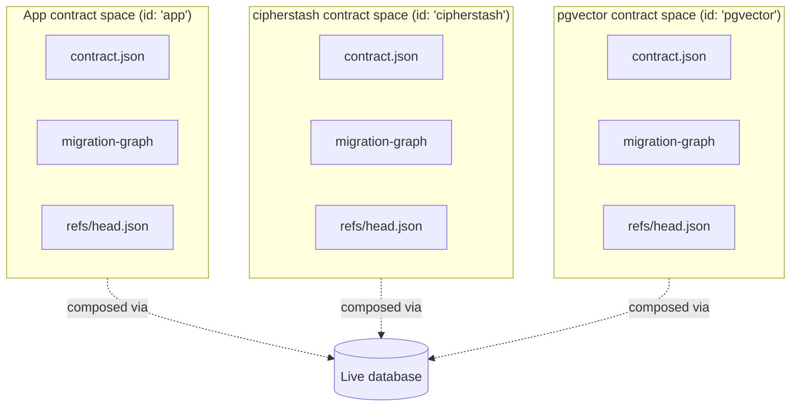

# ADR 212 — Contract spaces

## Status

Accepted (TML-2397). Supersedes the schema-contribution half of [ADR 154 — Component-owned database dependencies](./ADR%20154%20-%20Component-owned%20database%20dependencies.md). The `databaseDependencies` mechanism described there is removed from the framework as part of this work.

## At a glance

A Prisma Next application's database is the integration point for many parties: the application itself, plus every schema-contributing extension installed in `prisma.config.ts`. This ADR makes each of those parties a **contract space** — a disjoint `(contract.json, migration-graph, head-ref)` tuple — and runs the same per-space planner, runner, and verifier across all of them. The user's repo holds a pinned mirror of every space the database depends on, so apply-time and verify-time flows never need to read an extension package from `node_modules`.



## Context

Before this work, the framework had two parallel mental models for "schema":

- **Application schema** lived in the contract IR (`contract.json`), drove the planner / verifier / migration runner, and was version-controlled in the user's repo.
- **Extension schema** entered the database through `databaseDependencies.init` — an opaque list of SQL strings on the extension descriptor that ran during `db init`. The planner could not see it. The verifier could not describe it. The migration system could not advance it. Strict-mode `dbInit` rejected every object an extension installed as an "extra column / extra table / extra type."

Two band-aids accumulated. `strictVerification: false` globally relaxed the verifier so extension-installed objects no longer failed it — at the cost of also hiding hand-edited drift the user *did* want flagged. A per-extension allowlist on `ComponentDatabaseDependency.installs.{tables,schemas}` let extensions declare *what tables they install* but not *what shape those tables have*, so the verifier could only check existence, not structure. Both papered over the underlying gap: the contract layer had no seam through which a non-application party could say "I own these structures; manage them with the same machinery you manage the application's."

The cipherstash extension forced the conversation. It contributes ~5,750 lines of SQL: 1 schema, 1 table, several composite types and domains user `Encrypted<String>` columns reference via `nativeType`, plus 169 functions, 46 operators, 4 casts, and 9 operator classes. None of it was describable in any artifact the framework consumed; all of it was visible to the verifier. Monorepo aggregator packages (multiple internal contract owners composed by an aggregator) exhibit the same shape independently.

## Decision

Promote contract spaces to a first-class concept and treat them uniformly across the framework's planning / running / verifying machinery.

### What a contract space is

A **contract space** is a `(contractJson, migrations, headRef)` triple owned by exactly one contributor:

- The **application** owns one space, identified as `'app'`.
- Each loaded extension owns one space, identified by its declared `space-id` (e.g. `'cipherstash'`, `'pgvector'`).
- A monorepo aggregator package can compose multiple internal-package spaces with its own.

Spaces are **disjoint at the artefact level** (separate `contract.json`, separate migration graph) and integrate **only via the live database**. There is no merged contract on disk. The verifier aggregates spaces in memory at verify time, but never serializes the aggregate.

### Extension descriptor field: `contractSpace`

The SQL family's extension descriptor gains an optional `contractSpace` field. Schema-contributing extensions populate it; codec-only or query-op-only extensions leave it absent.

The shape is family-agnostic. `ContractSpace<TContract>` and `ContractSpaceHeadRef` live in `@internal/framework-components/control` so every family (SQL, Mongo, future) reuses the same triple; the family-side descriptor only specialises the contract type parameter:

```ts
// packages/1-framework/1-core/framework-components/src/control/control-spaces.ts
export interface ContractSpaceHeadRef {
  readonly hash: string;
  readonly invariants: readonly string[];
}

export interface ContractSpace<TContract extends Contract = Contract> {
  readonly contractJson: TContract;
  readonly migrations: readonly MigrationPackage[]; // canonical on-disk shape
  readonly headRef: ContractSpaceHeadRef;
}

// packages/2-sql/9-family/src/core/migrations/types.ts
export interface SqlControlExtensionDescriptor<TTargetId extends string>
  extends ControlExtensionDescriptor<'sql', TTargetId> {
  readonly contractSpace?: ContractSpace<Contract<SqlStorage>>;
}
```

Whether a value is the application's space or an extension's space is a control-plane concern (the descriptor it travels with, and the `space-id` the runner stamps onto the marker row); the type carries no such distinction. This is what lets the Mongo family adopt the concept by specialising the same generic to `ContractSpace<Contract<MongoStorage>>` without duplicating the structural shape.

There is **one** migration package shape across the workspace: `MigrationPackage` from `@internal/framework-components/control` (`{ dirName, metadata, ops }`), augmented to `OnDiskMigrationPackage` with a `dirPath` by the on-disk readers in `@internal/migration-tools`. The SQL family, the migration-tools I/O helpers, and the CLI's `runContractSpaceExtensionMigrationsPass` all consume that single shape — earlier parallel types (`ExtensionMigrationPackage`, `MigrationPackageContents`, `DescriptorMigrationPackage`) whose only difference was the absence of `dirPath` have been collapsed onto `MigrationPackage`.

The descriptor's `migrations` are the same artefacts the framework's emitter writes for application authors. The expected authoring convention is the **contract-space package layout** (see below): the extension's package contains its own emitted `src/contract.json` and `migrations/<dirName>/...` directories, and the descriptor module wires them via JSON-import declarations. The framework reads these values only at `migrate` time and materialises them into the consuming application's repo, where they become indistinguishable from app-authored migrations.

### Contract-space package layout

Every package that exposes a contract space — published extensions (`packages/3-extensions/<extension>/`), internal monorepo extension packages (`examples/multi-extension-monorepo/packages/<pkg>/`), and an aggregate-root application that emits its own contract (`examples/multi-extension-monorepo/app/`) — uses the same on-disk shape:

```text
<package>/
├── prisma.config.ts            ← contract-space-as-project config
├── migrations/
│   ├── refs/head.json               ← hand-pinned (cf. "Open work" below)
│   └── <timestamp>_<name>/          ← emitted by `migration plan` (one dir per migration)
│       ├── migration.json
│       ├── ops.json
│       ├── end-contract.json        ← bookend snapshot
│       ├── end-contract.d.ts
│       └── migration.ts             ← `Migration` subclass
└── src/
    ├── contract.prisma              ← PSL schema source when the space has app-visible schema (preferred — see below)
    ├── contract.ts                  ← optional TS source (narrow exception — see below)
    ├── contract.json                ← emitted (do not edit)
    ├── contract.d.ts                ← emitted (do not edit)
    └── exports/control.ts           ← descriptor; JSON-imports the artefacts
                                       (alternatively `src/control.ts` for
                                        internal/monorepo packages)
```

Key rules (these are the spots where mistakes recur, so the convention spells them out explicitly):

- **Pick the contract source by what the space contributes.** Three cases, each wired in `prisma.config.ts`:
  - *App-visible schema* (models, storage types, namespaces) → author PSL in `src/contract.prisma`; wire `prismaContract('./src/contract.prisma', { output: 'src/contract.json', target })`. PSL is the canonical authoring surface: it reads as a schema (not as builder calls), interoperates with brownfield Prisma schemas, and keeps the contract decoupled from the workspace's TS type system.
  - *Migrations only* — installs invariants (e.g. a Postgres extension) but ships no tables or native types → omit the contract source entirely; wire `emptyContract({ output: 'src/contract.json', target })`. Example: `@internal/extension-paradedb`.
  - *Typed objects PSL can't yet express* (e.g. pgvector's parameterised `vector` registration under `storage.types` — `types {}` blocks instantiate, they don't register a parameterised base type) → keep `src/contract.ts`; wire `typescriptContract(contract, 'src/contract.json')`, with a comment in the source naming the missing PSL surface.
- **No `<space-id>` subdirectory inside `migrations/`.** A package owns exactly one contract space, so the space-id directory adds no information. Migration directories sit *directly* under `migrations/`, and `refs/` sits at `migrations/refs/`. Configure this with `migrations.dir: 'migrations'` (not `migrations/<space-id>`).
- **No `src/contract/` subdirectory.** The contract source, emitted `contract.json`, and emitted `contract.d.ts` sit *directly* in `src/`.
- **`prisma.config.ts` is at the package root.** The CLI treats each contract-space package as a self-contained "project"; the in-package config is the source of truth for that project's emit and migration paths.

The contrast with the consuming app's on-disk layout: when an application composes multiple contract spaces, *its* `migrations/` directory ends up with one subdirectory per space (`migrations/<space-id>/`) because there are multiple spaces. That's an emergent shape from composition, not a per-package authoring convention. Inside a contract-space package, the space-id subdirectory does not belong.

Extension authors use the **same emit pipeline** application authors use: PSL (or TS) schema → `prisma-next contract emit` → `<package>/src/contract.{json,d.ts}`; `prisma-next migration plan` → `<package>/migrations/<dirName>/{migration.json, ops.json, end-contract.{json,d.ts}, migration.ts}`. The emitted `migration.ts` extends the same `Migration` abstract class app authors extend (from `@internal/<target>/migration`).

The descriptor module is the only TypeScript code that has to be hand-written:

```ts
// packages/3-extensions/<extension>/src/exports/control.ts
import contractJson from '../contract.json' with { type: 'json' };
import headRef from '../../migrations/refs/head.json' with { type: 'json' };
import baselineMetadata from '../../migrations/<dirName>/migration.json' with {
  type: 'json',
};
import baselineOps from '../../migrations/<dirName>/ops.json' with {
  type: 'json',
};

const baseline: MigrationPackage = {
  dirName: '<dirName>',
  metadata: baselineMetadata as unknown as MigrationMetadata,
  ops: baselineOps as unknown as readonly MigrationPlanOperation[],
};
```

The build pipeline emits the contract artefacts under `src/contract.{json,d.ts}` and `tsdown` bundles them into `dist/`. `prisma-next migration plan` is **not** part of the build script — it is non-idempotent (each invocation generates a new timestamped directory) and is run manually when the contract source changes, exactly the way application authors run it.

#### Two authoring paths: planner-emitted (A) vs hand-scaffolded (B)

Most extensions use **Path A**: `prisma-next migration plan` scaffolds the migration directory from the contract diff (cipherstash + the audit / feature-flags monorepo packages all follow this), and the resulting `migration.ts` is hand-edited to carry the extension's stable invariantIds and any non-derivable ops (e.g. cipherstash's `installEqlBundle` op + structural `cipherstash:create-*-v1` no-ops). `pnpm tsx migrations/<dirName>/migration.ts` then re-emits `ops.json` + `migration.json` deterministically.

A handful of extensions need **Path B** — hand-scaffolding the migration directory — when the contract declares only `storage.types` (no tables / models). For such contracts the planner returns `PN-CLI-4020 Contract changed but planner produced no operations`, so `migration plan` cannot scaffold the baseline. The author instead:

1. Creates `migrations/<timestamp>_<name>/` by hand.
2. Seeds `migration.json` with `from: null`, `to: <storageHash from contract.json>`, and `toContract` set to the emitted `<package>/src/contract.json` byte-for-byte.
3. Hand-authors `migration.ts` as a `Migration` subclass returning the production op list (typically a single `rawSql` op installing the underlying database extension) via the `operations` getter.
4. Runs `pnpm tsx migrations/<dirName>/migration.ts` to canonicalize `ops.json` + `migration.json` from the subclass output.

pgvector (whose contract declares only `vector(N)` under `storage.types`) is the exemplar. Future migrations on a Path-B-bootstrapped extension that *do* add tables / models can use `migration plan` (Path A) directly — the path choice is per-migration, not per-extension.

### On-disk layout (the user's repo)

```text
migrations/
├── 20260508T0942_user_init/         ← app-space migration (today's convention)
│   ├── manifest.json
│   ├── ops.json
│   └── contract.json
├── cipherstash/                     ← extension-space root
│   ├── contract.json                 ← pinned current contract
│   ├── contract.d.ts                 ← pinned current typings
│   ├── refs/head.json                ← pinned head ref (hash + invariants)
│   └── 20260601T0000_install_eql_bundle/
│       ├── manifest.json
│       ├── ops.json
│       └── contract.json
└── pgvector/
    ├── contract.json
    ├── contract.d.ts
    ├── refs/head.json
    └── 20240601T0000_install_vector/
        └── …
```

App-space's current `contract.json` continues to live at the project root (today's convention preserved). Extension-space contracts live as *pinned mirrors* under `migrations/<space-id>/`. The asymmetry is deliberate: app-space is the user's authoring surface; extension-space contracts are framework-owned mirrors of state authored elsewhere.

The framework owns the pinned files: every `migrate` invocation overwrites them from each loaded extension's descriptor `contractSpace` values, alongside materialising any new migration directories. The user reviews the resulting diff in their PR.

Space identifiers are constrained to `[a-z][a-z0-9_-]{0,63}` (filesystem-safe and round-trippable through path manipulation).

### Marker schema gains a `space` column

`prisma_contract.marker` was a single-row table keyed by `id`. It becomes one row per loaded contract space, primary-keyed by `space`. See [ADR 021 — Contract Marker Storage](./ADR%20021%20-%20Contract%20Marker%20Storage.md) for the migration path (idempotent across fresh / legacy single-row / already-migrated databases).

| `space`       | `applied_content_hash` | `applied_invariants`                          |
| ------------- | ---------------------- | --------------------------------------------- |
| `app`         | `0a82b3…`              | `["app:user-init-v1", …]`                     |
| `cipherstash` | `7f2c41…`              | `["cipherstash:install-eql-bundle-v1", …]`    |
| `pgvector`    | `9b7e88…`              | `["pgvector:install-vector-v1"]`              |

Three properties hold:

1. **The marker is the truth-of-record** for the live database's per-space applied state.
2. **The set of marker rows must equal the set of loaded spaces** (`'app'` plus every entry in `extensions`). Mismatches surface as verifier errors with clear remediation.
3. **Marker writes are atomic with the migrations that produced them.** Multi-space `db apply` opens one outer transaction; either every marker advances or none does.

### Per-space planner, runner, verifier

The framework runs the same machinery once per space:

- **Planner.** Diffs the prior contract for that space against the new contract for that space; produces a migration JSON for that space.
- **Runner.** Applies each space's migrations against the live database, updating the corresponding marker row.
- **Verifier.** Aggregates all loaded spaces' contracts into an in-memory expected schema, then compares against the live database.

The producer-side helpers (`planAllSpaces`, `concatenateSpaceApplyInputs`, `verifyContractSpaces`, `emitContractSpaceArtifacts`, `gatherDiskContractSpaceState`, `detectSpaceContractDrift`) live in `@internal/migration-tools/spaces` — target-agnostic primitives. The SQL family wires them into `db init` / `db update` / `db verify` at consumption sites; a Mongo or other family would compose them the same way (the contract-space concept is not SQL-specific even though today only the SQL family ships the wiring).

### Apply-time atomicity and ordering

Every multi-space apply runs inside a **single outer transaction**. The SQL family's `SqlMigrationRunner` was restructured to support this:

- `execute(options)` — single-space entry point. Opens its own transaction (today's behaviour preserved).
- `executeOnConnection(options)` — runner body without `BEGIN`/`COMMIT`. Caller owns the transaction lifecycle.
- `executeAcrossSpaces({ driver, perSpaceOptions })` — multi-space entry point. Opens **one** outer transaction and calls `executeOnConnection` per space inside it. Failure on any space rolls back every space's writes.

**Cross-space ordering**: extension spaces alphabetical-by-spaceId first, app-space last. The convention is sufficient for v1 (a formal cross-space dependency graph is deferred), and matches the implicit dependency direction — application schema may reference extension-provided types (`Encrypted<String>` → `eql_v2_encrypted`), so extension types must exist before the app's `CREATE TABLE` runs.

### Disjoint per-space ownership: schema-prune

Inside a multi-space apply, the app-space planner is invoked against the *full* introspected live schema. Without intervention it would see extension-owned tables (e.g. `eql_v2_configuration`, owned by cipherstash) as "extras" and emit `DROP TABLE` ops.

The fix is `pruneSchemaByOtherSpaceContracts`: before passing the introspected schema to the app-space planner, the runner reads the pinned `contract.json` of every *other* space and removes its tables from the introspection. The same property is enforced verifier-side by scoping `verifySqlSchema` to `space='app'` (per-space integrity is covered by `verifyContractSpaces` independently).

Both layers enforce the same invariant — disjoint per-space ownership — at different pipeline stages.

### `db init` and `db update`: per-space `findPathWithDecision`

Both flows reduce to the same per-space recipe (per [ADR 208 — Invariant-aware migration routing](./ADR%20208%20-%20Invariant-aware%20migration%20routing.md)):

1. For each loaded space, read the target ref:
   - app-space: read from the project root contract (or compute inline for greenfield).
   - extension-space: read the pinned `migrations/<space-id>/refs/head.json`.
2. Compute `effectiveRequired = ref.invariants − marker.invariants`.
3. Run `findPathWithDecision(currentMarker, ref.hash, effectiveRequired)`.
4. Concatenate all per-space results in the cross-space ordering convention; apply in a single transaction.

For app-space, the existing greenfield synthesis is preserved: when no app-space migrations are on disk, the framework synthesises a `∅ → head` edge from the contract IR. For extension-space, synthesis from the contract alone is impossible (the IR vocabulary doesn't admit functions / operators / etc., which are the body of opaque DDL ops), so the runner walks the explicit migration graph emitted under `migrations/<space-id>/`.

### Descriptor self-consistency

At family-create time the framework asserts `hash(canonicalize(descriptor.contractSpace.contractJson)) === descriptor.contractSpace.headRef.hash`. Mismatch surfaces as `MIGRATION.DESCRIPTOR_HEAD_HASH_MISMATCH` and identifies the offending extension. Catches the case where an extension author published an inconsistent descriptor (e.g. updated `contractJson` but forgot to regenerate `headRef.hash`).

### What apply-time does not need

Once `migrate` has run, the user's repo carries everything `db init` / `db apply` / `db verify` need: app-space `contract.json` at the project root, plus pinned per-space `contract.json` / `contract.d.ts` / `refs/head.json` and migration directories under `migrations/<space-id>/`. Apply-time and verify-time paths read **only** the user's repo — they never import an extension descriptor module. This is what makes the system work in CI / production environments where the extension package may not even be installed:

```bash
$ rm -rf node_modules/@internal/extension-cipherstash
$ prisma-next db init     # ✓ reads only migrations/cipherstash/ on disk
$ prisma-next db apply    # ✓ no migrations to apply
$ prisma-next migrate     # ✗ MIGRATION.EXTENSION_DESCRIPTOR_NOT_FOUND
                          #   cipherstash is in extensions but the package
                          #   isn't installed. Run: pnpm install
```

`migrate` (authoring-time) needs the descriptor to read the extension's *current* state for diffing. Apply-time (`db init` / `db update`) and verify-time (`db verify`) do not.

### Verifier integrity checks

`verifyContractSpaces` reports five structurally distinct violation kinds, each with an actionable remediation hint:

| Kind | Cause |
|---|---|
| `declaredButUnmigrated` | Extension declared in `extensions` but no pinned `contract.json` on disk. |
| `orphanMarker` | Marker row for a space not in `extensions`. |
| `orphanPinnedDir` | Pinned `migrations/<space-id>/` directory for a space not in `extensions`. |
| `hashMismatch` | Marker row's hash differs from pinned contract's hash (or descriptor's hash, depending on which side is being checked). |
| `invariantsMismatch` | Pinned contract's required invariants are not all in the marker row's applied invariants set. |

(Replaces the legacy `dependency_missing` `SchemaIssue` kind — see "Reporting" below.)

## IR vocabulary boundary (preserved)

The contract IR continues to admit only what a column or field can name as `nativeType`:

- **In IR:** tables (with columns, primary keys, foreign keys, indexes, uniques), enums, composite types, domains.
- **Not in IR:** schemas, functions, operators, casts, operator classes/families.

The same boundary applies across all spaces. Cipherstash's space declares `eql_v2_configuration` (table), `eql_v2_configuration_state` (enum), `eql_v2_encrypted` (composite), and the `eql_v2.{bloom_filter,hmac_256,blake3}` domains in its `contract.json` (~3-5 KB). The remaining ~5,750 lines of bundle SQL — functions, operators, casts, op classes — live as the body of one migration op (`installEqlBundle`) inside cipherstash's migration graph, with its own `invariantId`. The verifier is symmetrically blind to those objects on both sides — `verifySqlSchema` doesn't enumerate them, and the IR doesn't declare them — so strict mode is preserved without rejecting them.

Pgvector's `vector` type is in its IR; `CREATE EXTENSION vector` is the body of one migration op. Same shape.

## Migration JSON shape

A single `migrate` invocation produces one migration directory per space whose contract changed in this emit, plus refreshed pinned per-space files for every loaded extension. Each migration's `ops.json` is space-scoped — it contains only ops belonging to that space.

**Codec-emitted ops belong to app-space** and are inlined into the relevant app-space migration's `ops.json` alongside the user's own structural ops. See [ADR 213 — Codec lifecycle hooks](./ADR%20213%20-%20Codec%20lifecycle%20hooks.md) for the hook contract and rationale.

```jsonc
// app-space migration: 20260508T0942_user_init/ops.json
{
  "from": null,
  "to": "<app new hash>",
  "operations": [
    { "invariantId": "app:create-table-User-v1",
      "execute": [{ "sql": "CREATE TABLE \"User\" (...)" }] },
    { "invariantId": "cipherstash-codec:User.email:add-search-config@v1",
      "execute": [{ "sql": "INSERT INTO eql_v2_configuration (...) VALUES (...)" }] }
  ]
}
```

```jsonc
// cipherstash-space migration: cipherstash/20260601T0000_install_eql_bundle/ops.json
{
  "from": null,
  "to": "<cipherstash hash>",
  "operations": [
    { "invariantId": "cipherstash:install-eql-bundle-v1",
      "execute": [{ "sql": "...EQL bundle SQL..." }] },
    { "invariantId": "cipherstash:create-eql_v2_configuration-v1",
      "execute": [{ "sql": "SELECT 1" }] }
  ]
}
```

## Reporting

The legacy `dependency_missing` `SchemaIssue` kind is removed. The same diagnostic is now reported through the per-space verifier as one of:

- `EXTENSION_HEAD_REF_DRIFT` — pinned head ref's hash differs from the marker (extension is "behind" or "ahead").
- `EXTENSION_HEAD_REF_MISSING` — marker row exists but the pinned head ref is absent (or vice versa) — typically `declaredButUnmigrated` or `orphanMarker`.

The reporting is structurally richer than `dependency_missing` because each kind is independently triggerable and carries a specific remediation hint.

## Lifecycle: who reads from where

| Operation               | Reads descriptor | Reads on-disk pinned state | Reads marker         |
| ----------------------- | ---------------- | -------------------------- | -------------------- |
| `prisma-next migrate`   | yes              | yes (compare)              | no                   |
| `prisma-next db init`   | no               | yes                        | yes (writes)         |
| `prisma-next db apply`  | no               | yes                        | yes (read + advance) |
| `prisma-next db verify` | no               | yes (compare)              | yes (compare)        |

The asymmetry between `migrate` (authoring) and the apply/verify path is what makes pinned per-space artefacts load-bearing.

## Consequences

### Positive

- **Extensions are uniformly observable and verifiable.** Strict-mode `dbInit` no longer rejects extension-installed schema objects — they are declared in the extension's contract and aggregated into the verifier's expected schema.
- **One mental model for schema ownership.** The planner, runner, and verifier no longer need a separate "extension" code path; the same primitives serve app-space, extension-space, and (in future) monorepo composition.
- **WYSIWYG-runnable repos.** Every artefact required to apply, hash, verify, or audit the database's expected schema is on disk in the user's repo. CI / production paths never load extension descriptors.
- **Multi-space transactional apply.** `executeAcrossSpaces` is reusable for any future "compose multiple migration sources into one apply" use case (not just extensions).
- **Richer drift detection.** Bumping an extension's package version produces a clear PR diff (updated pinned `contract.json` / `contract.d.ts` / `refs/head.json`, plus any new migration directories). The legacy `databaseDependencies.init` mechanism produced no diff at all.

### Trade-offs

- **Extension authors must ship a contract + migration graph**, not just an init-SQL string. The contract-space package layout convention reuses the same CLI pipeline app authors use, so the authoring story is symmetrical: write a TS or PSL schema, run `prisma-next contract emit` + `prisma-next migration plan`, and the descriptor module JSON-imports the resulting artefacts. The framework helpers `emitContractSpaceArtifacts` / `materialiseExtensionMigrationPackageIfMissing` cover the consuming application's repo half; cipherstash, pgvector, and paradedb all ship this convention.
- **`migrate` becomes the canonical way to materialise extension bumps.** Bumping an extension in `node_modules` without running `migrate` produces stale pinned artefacts; the drift-detection helper surfaces a non-fatal warning at the next `migrate` invocation.
- **One outer transaction across spaces** is a stronger correctness guarantee than the per-extension `databaseDependencies.init` path provided. The framework inherits the constraint that all SQL across all spaces in a single emit must be transactionally compatible (which is already true of the existing single-space path).

### Non-goals (deferred)

- **Extension removal semantics.** Removing an extension from `extensions` while user schema still depends on extension-installed types (e.g. `Encrypted<String>` columns referencing `eql_v2_encrypted`). Until addressed, removal is unsupported and the verifier reports orphan marker rows as errors.
- **Codec-id-changed lifecycle event.** When a user upgrades an extension in a way that changes a codec ID (`cipherstash:string@1` → `@2`), the codec needs a way to emit a "rotate" migration op. Cleanly extends the existing event vocabulary; deferred until needed.
- **Cross-space dependencies as a first-class concept.** Convention-based ordering (extensions first, app-space second) is sufficient for v1 given the single-transaction property.
- **Cross-space codec hooks.** Codec-emitted ops are app-space-bound by API shape — the hook signature has no parameter for cross-space context. See [ADR 213](./ADR%20213%20-%20Codec%20lifecycle%20hooks.md).
- **`migrations/refs/head.json` ergonomics.** Today the extension author hand-pins `migrations/refs/head.json` after running `migration plan` (copy `to` from the latest migration's metadata; copy `providedInvariants` from the same). Adding a `prisma-next refs update` (or equivalent) command that emits/refreshes head pins from the latest migration is a small follow-up.

## Related

- [ADR 021 — Contract Marker Storage](./ADR%20021%20-%20Contract%20Marker%20Storage.md) — marker schema gain of `space` column; PK change to `(space)`.
- [ADR 154 — Component-owned database dependencies](./ADR%20154%20-%20Component-owned%20database%20dependencies.md) — superseded by this ADR.
- [ADR 197 — Migration packages snapshot their own contract](./ADR%20197%20-%20Migration%20packages%20snapshot%20their%20own%20contract.md) — per-package metadata shape used by `MigrationPackage`.
- [ADR 208 — Invariant-aware migration routing](./ADR%20208%20-%20Invariant-aware%20migration%20routing.md) — `findPathWithDecision` primitive that `db init` / `db update` use per space.
- [ADR 169 — On-disk migration persistence](./ADR%20169%20-%20On-disk%20migration%20persistence.md) — the migration directory shape extended per-space.
- [ADR 213 — Codec lifecycle hooks](./ADR%20213%20-%20Codec%20lifecycle%20hooks.md) — schema-driven companion mechanism that emits app-space ops in response to per-field events.
