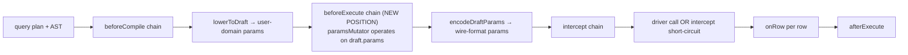

# ADR 215 — Runtime middleware lifecycle: operation-specific query and execute hooks

## Current status

Accepted. The shipped runtime uses operation-specific query and execute middleware lifecycles. In the current SQL runtime, `query()` streams rows through `queryAgainstQueryable` and `execute()` returns statistics through `executeStatisticsAgainstQueryable`. The operation-specific lifecycle amendment below supersedes only the SPI lifecycle shape and terminology; the original May 2026 decision and its rationale remain preserved in the historical section.

## Amendment (August 12, 2026) — operation-specific lifecycle

### At a glance

Runtime operations answer two different questions. `query()` streams rows, while `execute()` runs a non-row statement and returns statement statistics. The middleware contract mirrors that distinction in its hook names and result shapes:

```text
SQL beforeCompile (AST-backed plans only; shared for both operations)
  ├─ query:   beforeQuery → encodeParams → interceptQuery → driver query → onRow → afterQuery
  └─ execute: beforeExecute → encodeParams → interceptExecute → driver execute → afterExecute

Raw SQL plans are already lowered and bypass `beforeCompile`; they enter the operation-specific path directly.
```

The `encodeParams` step is shown between the before and intercept hooks because parameter-mutating middleware must see user-domain values before encoding, while interceptors see the fully encoded execution plan. The public lifecycle is operation-specific; there is no operation discriminator on the middleware context or completion result.

### Context

The generic `RuntimeCore` first applies its compile hook when the family supplies one, lowers the plan to an executable plan, and then runs the selected operation-specific before hook. For AST-backed SQL plans, `beforeCompile` is the SQL compile hook; already-lowered raw SQL plans bypass it. SQL and Mongo production overrides refine that ordering: they lower to a structural draft containing user-domain parameter values, run `beforeQuery` or `beforeExecute` with the family mutator, and then encode or resolve the mutated values before passing the final execution plan to the matching interceptor and driver terminal.

This ordering keeps parameter-mutating middleware structurally possible. For example, encryption middleware can populate a value's ciphertext before the codec encodes it. It also keeps interception truthful: a query interceptor supplies rows, and an execute interceptor supplies statistics. No runtime path derives a count from a row array.

The earlier implementation used one generic lifecycle and one `intercept` hook. That shape made a row result and a statistics result share a vocabulary, encouraged operation inference, and could make parameter-mutating middleware run after encoding. The operation-specific contract is a compatibility-free hard cut: middleware authors select the operation they implement.

### Decision

### Shared compilation and operation selection

For an AST-backed SQL plan, SQL runs `beforeCompile` once before choosing the operation. This hook rewrites the SQL AST and is shared by row and statistics operations. Already-lowered raw SQL plans bypass it. `beforeCompile` is not a query or execute hook and does not carry an operation discriminator.

After compilation or the raw-plan bypass, the runtime chooses one of these explicit paths:

- `query(plan, options?)` returns `AsyncIterableResult<Row>`. It runs `beforeQuery`, encodes parameters, runs `interceptQuery`, and either consumes the intercepted rows or calls `SqlQueryable.query()`. Driver rows pass through `onRow` and are then decoded for the consumer. `afterQuery` receives row count, completion, latency, and source.
- `execute(plan, options?)` returns `Promise<RuntimeStatementStats>`. It runs `beforeExecute`, encodes parameters, runs `interceptExecute`, and either returns intercepted statistics or calls `SqlQueryable.execute()`. `afterExecute` receives the statistics on success, or a completion failure without statistics.

The SQL runtime uses one preparation structure for both paths: lower to a pre-encode draft, run the selected before chain, encode the draft, and invoke the selected terminal. Prepared row queries use the same query lifecycle with a request handle; the handle does not create a separate middleware operation.

#### Query lifecycle

The query lifecycle is, in order:

1. On an AST-backed SQL plan, `beforeCompile` runs once and may return a rewritten AST. An already-lowered raw SQL plan bypasses this hook.
2. `beforeQuery` runs in middleware registration order on the lowered draft. It may use the SQL parameter mutator; errors abort before interception and do not invoke `afterQuery`.
3. The runtime encodes the possibly mutated parameter values.
4. `interceptQuery` runs in registration order on the encoded execution plan. The first non-`undefined` `{ rows }` result wins. A hit skips the driver and `onRow`; the intercepted rows still flow to the consumer and `afterQuery` reports `source: 'middleware'`.
5. On a miss, `SqlQueryable.query(request)` supplies the row stream. `onRow` runs for each driver row before the row is yielded to the consumer.
6. `afterQuery` runs once with `{ rowCount, latencyMs, completed, source }`. Completion errors are swallowed on the error path so they do not mask the original query, interception, or driver error.

`QueryInterceptResult` is deliberately row-shaped:

```ts
interface QueryInterceptResult {
  readonly rows: AsyncIterable<Record<string, unknown>> | Iterable<Record<string, unknown>>;
}
```

#### Execute lifecycle

The execute lifecycle is, in order:

1. On an AST-backed SQL plan, `beforeCompile` runs once and may return a rewritten AST. An already-lowered raw SQL plan bypasses this hook.
2. `beforeExecute` runs in middleware registration order on the lowered draft. It may use the SQL parameter mutator; errors abort before interception and do not invoke `afterExecute`.
3. The runtime encodes the possibly mutated parameter values.
4. `interceptExecute` runs in registration order on the encoded execution plan. The first non-`undefined` `{ stats }` result wins. A hit skips the driver and returns the supplied statistics eagerly.
5. On a miss, `SqlQueryable.execute(request)` returns the driver's actual statement statistics. There is no row stream and `onRow` does not run.
6. `afterExecute` runs once with `{ stats, latencyMs, completed: true, source }` on success, or `{ latencyMs, completed: false, source }` on failure. Completion errors are swallowed on the error path so they do not mask the original execute, interception, or driver error.

`ExecuteInterceptResult` is deliberately statistics-shaped:

```ts
interface ExecuteInterceptResult {
  readonly stats: RuntimeStatementStats;
}
```

The first non-`undefined` interceptor wins independently on each operation. A query interceptor cannot satisfy an execute operation, and an execute interceptor cannot supply query rows. This is enforced by the hook names and types rather than a runtime `operation` field.

#### Context and result shape

`RuntimeMiddlewareContext` is shared by all hooks selected for one operation and carries the contract, cancellation signal, scope, content-hash function, and `planExecutionId`. It does not carry an operation discriminator. Hook selection is the discriminator.

The completion types are likewise operation-specific:

- `AfterQueryResult` has `rowCount`, `latencyMs`, `completed`, and `source`.
- `AfterExecuteResult` has `latencyMs`, `completed`, and `source`, plus `stats` only when `completed` is `true`.

This prevents statistics middleware from accidentally treating a row count as an affected-row count. `affectedRows` comes from `SqlQueryable.execute()` or an explicit execute interception result.

### Scope composition

Every SQL runtime scope exposes both semantic operations through the same `RuntimeScope` contract:

```ts
interface RuntimeScope {
  query<Row>(plan: SqlOrmPlan<Row>, options?: RuntimeExecuteOptions): AsyncIterableResult<Row>;
  execute(plan: SqlOrmPlan, options?: RuntimeExecuteOptions): Promise<SqlStatementStats>;
}
```

The top-level runtime, checked-out connection, transaction, guarded transaction context, and Supabase role-bound scopes route each operation to their bound `SqlQueryable`. A query result remains lazy and must be consumed while its connection or transaction is valid. Statistics execution is eager and resolves to `{ affectedRows }`.

### Consequences

- Parameter-mutating middleware sees user-domain values before codec encoding on both operation paths.
- Interceptors see the final encoded plan, so cache keys and other observations match the request sent to the driver.
- Query middleware can observe rows through `onRow`; execute middleware cannot accidentally receive a row stream.
- A statistics result cannot be fabricated from query rows. An interceptor must return `{ stats }`, and a driver must return actual statement statistics.
- Middleware that applies to both operations implements the corresponding hooks twice or delegates both names to one private function. There are no generic fallback aliases.
- A before-hook failure occurs outside the managed terminal lifecycle and therefore does not invoke the matching after-hook. Failures during interception, driver execution, or row consumption do invoke the matching after-hook with `completed: false`.

## Original decision (May 2026)

> The following section preserves the accepted May 2026 decision and rationale. It describes the generic-hook lifecycle that was in force before the August 12, 2026 amendment; its historical `intercept`, `onRow`, and `afterExecute` vocabulary is not a description of the current operation-specific SPI.

### At a glance

`RuntimeMiddleware.beforeExecute(plan, ctx, paramsMutator?)` now fires *after* the family runtime lowers the query plan into a draft execution plan (parameters present in user-domain form) but *before* the runtime encodes those parameters to driver wire format. Mutations the hook makes through `paramsMutator` are visible to the subsequent encode step. The hook previously fired *after* encode, which made parameter-mutating middleware structurally impossible to implement correctly.



### Context

Before this ADR the SQL family runtime composed the execution lifecycle as:

```text
runBeforeCompile(plan)           // middleware AST rewrites
 → lower(plan)                   // lowerSqlPlan + encodeParams in one call
 → runWithMiddleware(exec, ...)  // beforeExecute → intercept → onRow → afterExecute
```

The `runWithMiddleware` helper (in `@internal/framework-components`) owned four chains. `beforeExecute` fired with a `paramsMutator` constructed from the *post-encode* `exec.params` — wire bytes — which is too late for any middleware that wants to compute or mutate parameter values in their user-domain shape.

This blocked the cipherstash bulk-encrypt middleware end-to-end. The middleware's design: walk the plan's `ParamRef` nodes, find every cipherstash envelope sitting in a parameter slot, group them by `(table, column)` routing key, issue one `sdk.bulkEncrypt(...)` per group, and write the resulting ciphertexts back onto the envelope handles. The codec's `encode(envelope, ctx)` body reads `handle.ciphertext` to produce the wire-format payload and throws if it's undefined (a deliberate strict guard — a codec asked to encode an envelope without a ciphertext has no correct answer). When `beforeExecute` fired post-encode:

- `encodeParams` ran first, walked every `ParamRef`, called the cipherstash cell codec's `encode` per envelope, and threw `cipherstash codec: envelope has no ciphertext at encode time` because the bulk-encrypt middleware that would have populated ciphertexts had not yet run.
- The strict guard was correct; the lifecycle ordering was wrong.

The same problem applies to any future param-mutating middleware (server-side request-id stamping, deterministic-encryption codec adapters, value-elaboration policies, etc.). It is not cipherstash-specific.

Three alternatives were considered:

1. **Relax the cipherstash codec's `encode` guard** so a missing ciphertext defers to a runtime hook. Pushes cipherstash-specific assumptions into framework primitives and breaks the principle that codec `encode` is a pure function of `(value, ctx)`. Rejected.
2. **Encode parameters in two passes** — first a "soft" encode that tolerates missing ciphertexts, then `beforeExecute`, then a "hard" re-encode. Doubles the encode cost on every query for the benefit of one middleware family. Rejected.
3. **Reorder the lifecycle so `beforeExecute` fires between lower and encode** with a `paramsMutator` over pre-encode user-domain values. Touches one seam at one framework layer; no codec changes; no SPI shape changes. **Accepted.**

The reorder is safe because every existing `beforeExecute` consumer falls into one of two categories:

| Consumer | What it does | Reorder impact |
|---|---|---|
| Cipherstash bulk-encrypt middleware | Walks `plan.ast`, finds envelope `ParamRef`s, calls SDK, mutates handle ciphertexts via `paramsMutator.replaceValues(...)` | Unblocked — now sees pre-encode envelopes |
| `@internal/middleware-telemetry` | Reads `plan.meta` for telemetry tagging | Neutral — meta is unchanged across the seam |
| SQL runtime `budgets` middleware | Reads `plan.ast` and uses `plan` identity as a Map key for per-query budget accounting | Neutral — AST is unchanged; identity is preserved |
| SQL runtime `lints` middleware | Reads `plan.ast` for lint evaluation | Neutral — AST is unchanged across the seam |

The three observability middleware never touch `params`. The audit was independently confirmed by reviewer inspection before the reorder landed; an architectural reading also supports it: telemetry, budgets, and lints are by-design read-only over the plan shape. Param-mutation is a special-purpose contract that until cipherstash had no consumer.

### Decision

#### Lifecycle reorder

The historical decision described the SQL family runtime's per-operation lifecycle as:

```text
runBeforeCompile(plan)
 → lowerToDraft(plan)                // AST + user-domain params; no codec encode yet
 → runBeforeExecuteChain(            // NEW POSITION
     draft, middleware, ctx,
     paramsMutator over draft.params
   )
 → encodeDraftParams(draft', ctx)    // params through per-column codecs; wire format
 → runWithMiddleware(exec, ...)      // intercept → driver → onRow → afterExecute
```

The split between `lowerToDraft` (private, returns a draft with pre-encode `params`) and `encodeDraftParams` (private, renders the draft's params through the codec registry) replaces the prior single-call `lower()` shape. The pre-encode `paramsMutator` is a `SqlParamRefMutator` constructed over the draft's params; mutations are visible to `encodeDraftParams` through the mutator's `currentParams()` view.

#### `runWithMiddleware` no longer owns `beforeExecute`

The `beforeExecute` chain is extracted from `runWithMiddleware` into a free function `runBeforeExecuteChain(plan, middleware, ctx, paramsMutator?)` exported from `@internal/framework-components/execution`. `runWithMiddleware` now owns three chains (`intercept`, the row-source loop driving `onRow`, and `afterExecute`) and accepts no `paramsMutator` parameter — the one prior consumer of that parameter was the extracted chain.

The extraction preserves all SPI semantics:

- **Registration order** — middleware run in registration order across both `runBeforeExecuteChain` and `runWithMiddleware`.
- **Abort handling** — `checkAborted(ctx, 'beforeExecute')` short-circuits a chain entry when the caller has already aborted; an in-flight `beforeExecute` body's Promise is raced against `ctx.signal` via `raceAgainstAbort`. Both behaviours mirror the prior in-`runWithMiddleware` chain semantics byte-for-byte.
- **SPI shape** — `RuntimeMiddleware.beforeExecute(plan, ctx, params?) => void | Promise<void>` is unchanged. Existing middleware bodies compile and run without modification; JavaScript's positional-argument tolerance handles bodies that ignore the third parameter.

#### `intercept` always observes a post-`beforeExecute` plan

The `beforeExecute` chain always fires, even when a later `intercept` short-circuits the driver call. This is the load-bearing semantic decision in the reorder:

- **Cache middleware (the canonical `intercept` consumer)** computes a content-hash over the plan to key cache entries. If `beforeExecute` were *skipped* on intercept hits, the content-hash on a cold path (where `beforeExecute` ran and mutated params) would differ from the content-hash on a warm path (where it didn't). The cache would never hit. Skipping is incorrect.
- **`afterExecute(completed: false)` semantics** continue to apply uniformly. A `beforeExecute` body that throws propagates the error out of `runBeforeExecuteChain`, the family runtime catches it, and the `afterExecute` chain in `runWithMiddleware` is *not* invoked because the runtime never reached `runWithMiddleware`. The contract `afterExecute(completed: false)` is reserved for middleware that observed the intent to execute — `beforeExecute` is part of that intent, not separate from it.

The alternative reading (`beforeExecute` skipped on intercept short-circuit) would have been principled if no middleware needed param-mutation semantics for caching purposes. The cipherstash case in particular needs ciphertexts populated before the content-hash is computed so the cache key reflects the actual driver-bound payload. The chosen reading is the defensible one.

#### Implementation boundary in the shipped runtime

The generic `RuntimeCore.execute` does not implement this split. In the current source it runs `runBeforeCompile(plan)`, calls the abstract `lower(compiled, codecCtx)` to obtain the executable `TExec`, then invokes `runBeforeExecuteChain` and `runExecuteWithMiddleware` on that executable plan. It has no generic pre-encode draft or encode step. The pre-encode split is family override behavior: SQL's `prepareOperation` calls `lowerToDraft`, runs the selected before chain, and then calls `encodeDraftParams`; Mongo's `prepareOperation` calls `structuralLower`, runs the selected before chain, and then calls `resolveParams`.

The SQL runtime override threads its family-specific `SqlParamRefMutator` (constructed over the draft's params) and `SqlCodecCallContext` (carrying per-query `AbortSignal`) explicitly. That override path also distinguishes the "pre-lowered fixture path" (caller hands in a `SqlExecutionPlan` directly; runtime still fires `beforeExecute` and then re-encodes to apply any mutations) from the standard AST → exec path. Both paths thread through the same `runBeforeExecuteChain` helper.

### Consequences

#### Positive

- **Param-mutating middleware is now structurally possible.** The cipherstash bulk-encrypt middleware works end-to-end without changes to the cell codec's strict `handle.ciphertext === undefined` guard. Future param-mutating middleware (deterministic-encryption codec adapters, server-side value-elaboration policies, masked-column rewrites) inherit the same ordering.
- **No SPI change.** `RuntimeMiddleware.beforeExecute` retains its `(plan, ctx, params?)` shape and its registration semantics. Existing middleware bodies compile and run unchanged. The three observability middleware in tree (`middleware-telemetry`, `budgets`, `lints`) are reorder-neutral.
- **Cache content-hash stability.** Interceptors observe the fully-mutated plan, so the content-hash they compute is consistent between cold and warm paths. A naïve cache implementation works correctly with param-mutating middleware in the chain.
- **Family-specific placement of the split.** `runBeforeExecuteChain` is family-agnostic, but the pre-encode draft seam is not supplied by `RuntimeCore`. SQL and Mongo call it from their own split preparation paths; a future family must choose and implement its own equivalent seam if it needs mutation before encoding.
- **Pre-lowered fixture path preserved.** Test fixtures that hand in a `SqlExecutionPlan` directly (skipping the AST → draft lower step) still fire `beforeExecute` and then re-encode to apply any mutations. The fixture-path encoder runs a second encode in this branch, which is intentional — the alternative (skip the second encode and trust the fixture's pre-encoded params) would defeat any mutation the middleware made.

#### Trade-offs

- **Param encoding cost on the fixture path.** The pre-lowered fixture path re-encodes params even when no middleware mutated them. The cost is proportional to the param count and codec complexity, negligible relative to a driver round-trip. Documented inline at the override site.
- **Two engagement points for `beforeExecute`.** The generic `RuntimeCore.execute` invokes the chain after its family-supplied `lower` result, while SQL and Mongo invoke it in their own pre-encode split preparation paths. A family override that replaces `execute` must call the helper at its chosen seam; the generic base does not provide pre-encode mutation automatically.
- **Order semantics for `intercept` slightly more subtle.** Documented in the SPI JSDoc: interceptors see a post-`beforeExecute` plan. A middleware author who relied on the old ordering (`intercept` first, `beforeExecute` only on non-intercept paths) needs to update. The audit found no such in-tree consumer; external consumers (when this project ships outside the prototype) need release-notes coverage.

#### Non-goals

- **No `paramsMutator` for `intercept`, `onRow`, or `afterExecute`.** Param mutation is a `beforeExecute`-only contract; once `encodeDraftParams` runs, the params are wire bytes and mutating them is not meaningful. The middleware SPI does not offer the mutator at later hooks.
- **No re-ordering between `intercept` and the row-source loop.** This ADR only moves `beforeExecute`. The four remaining chains (`beforeCompile`, `intercept`, `onRow`, `afterExecute`) retain their prior ordering and contracts.

### Worked example — cipherstash bulk-encrypt middleware

The cipherstash extension's bulk-encrypt middleware is the load-bearing worked example. Pre-ADR, the middleware was an aspirational shape that compiled but always threw at execute time. Post-ADR, the middleware works as designed:

```ts
// packages/3-extensions/cipherstash/src/middleware/bulk-encrypt.ts
export function bulkEncryptMiddleware(sdk: CipherstashSdk): SqlMiddleware {
  return {
    async beforeExecute(plan, ctx, params) {
      // 1. Walk `plan.ast` and find every cipherstash envelope sitting
      //    in a parameter slot. Each envelope's handle carries its
      //    routing key (table, column) — stamped at AST construction
      //    time by the cipherstash operators.
      const groups = collectByRoutingKey(plan, params);

      // 2. One SDK round-trip per (table, column) group.
      for (const [{ table, column }, batch] of groups) {
        const ciphertexts = await sdk.bulkEncrypt({
          routingKey: { table, column },
          values: batch.map((e) => e.expose().plaintext),
          signal: ctx.signal,
        });

        // 3. Write the ciphertexts back onto the envelope handles
        //    via the param-mutator. Encode then reads handle.ciphertext.
        batch.forEach((envelope, i) => {
          envelope.setHandleCiphertext(ciphertexts[i]);
          // params.replaceValues(envelope.paramRefId, envelope);  // identity-replace
        });
      }
    },
  };
}
```

When `beforeExecute` returns, the draft plan's `params` slot contains the same envelope references that entered, but each envelope's handle now has its ciphertext populated. `encodeDraftParams` then walks the params, dispatches to the cipherstash cell codec per envelope, and the codec's `encode` body reads `handle.ciphertext` successfully. The driver sees wire-format `eql_v2_encrypted` JSONB payloads in the param slots.

The same shape applies to any future param-mutating middleware: any middleware that wants to populate or rewrite parameter values in their user-domain form before encode runs the same lifecycle position.

### Mongo family: lifecycle parity and intentional placement asymmetries

Mongo uses the same pre-resolve invariant as SQL, but its operation paths are explicit: query uses `structuralLower` → `beforeQuery` with a param mutator → `resolveParams` → `interceptQuery` / driver rows → `onRow` → `afterQuery`; execute uses `structuralLower` → `beforeExecute` with a param mutator → `resolveParams` → `interceptExecute` / driver statistics → `afterExecute`. Content hashing ([`content-hash.ts`](../../../packages/2-mongo-family/7-runtime/src/content-hash.ts)) runs on the post-resolution execution plan, so interceptors and cache keys observe the driver-bound payload after middleware mutations — the same load-bearing property ADR 215 establishes for SQL.

The SQL and Mongo stacks differ in *where* the two lowering phases and the param mutator live. Those differences are intentional family shape, not drift.

| Concern | SQL | Mongo |
|---|---|---|
| Two-phase lowering API | `lowerToDraft` / `encodeDraftParams` are **private** methods on `SqlRuntimeBase` ([`packages/2-sql/5-runtime/src/sql-runtime.ts`](../../../packages/2-sql/5-runtime/src/sql-runtime.ts)); lowering walks the SQL adapter inside the runtime package. | `structuralLower` / `resolveParams` are **public** methods on the `MongoAdapter` SPI ([`packages/2-mongo-family/6-transport/mongo-lowering/src/adapter-types.ts`](../../../packages/2-mongo-family/6-transport/mongo-lowering/src/adapter-types.ts)); the target-owned implementation lives in [`@internal/adapter-mongo`](../../../packages/3-mongo-target/2-mongo-adapter/). |
| Param mutator home | `SqlParamRefMutator` in [`packages/2-sql/4-lanes/relational-core`](../../../packages/2-sql/4-lanes/relational-core) (middleware module), composed by the SQL runtime. | `MongoParamRefMutator` in [`packages/2-mongo-family/7-runtime`](../../../packages/2-mongo-family/7-runtime/src/param-ref-mutator.ts) alongside `MongoMiddleware`, because Mongo has no `relational-core`-equivalent lanes layer — the runtime is the first layer that composes middleware and execute. |
| Pre-resolve draft type | Reuses `SqlExecutionPlan` for both the pre-encode draft and the post-encode exec (params slot mutates; same interface type). | The adapter exposes a distinct `MongoLoweredDraft` union for phase 1, but the runtime temporarily places that draft in `MongoExecutionPlan.command` through a narrow `blindCast` while running the selected before hook ([`mongo-runtime.ts`](../../../packages/2-mongo-family/7-runtime/src/mongo-runtime.ts)). The adapter boundary distinguishes the phases; the temporary middleware plan representation does not. |

**Why the phase API is public on Mongo but private on SQL.** SQL structural lowering and param encoding are orchestrated entirely inside `@internal/sql-runtime` against the generic SQL `Adapter` surface. Mongo lowering is target-owned: the runtime invokes `MongoAdapter` on the execution stack, and the two-phase contract must be auditable at the adapter SPI so implementors (`adapter-mongo`) and reviewers can see exactly where `MongoParamRef` resolution is deferred relative to middleware. Exposing `structuralLower` / `resolveParams` on the SPI documents that contract; hiding them inside the runtime would obscure the target boundary.

**Convenience `lower`.** `MongoAdapter.lower` remains the one-shot `resolveParams(structuralLower(plan))` for callers that do not need the split; production runtime query and execute paths use `structuralLower` and `resolveParams` separately around their matching before hook.

## Related

- [ADR 204 — Single-tier runtime](./ADR%20204%20-%20Single-tier%20runtime.md) — the family runtime composition this ADR refines.
- [ADR 207 — Codec call context per-query AbortSignal and column metadata](./ADR%20207%20-%20Codec%20call%20context%20per-query%20AbortSignal%20and%20column%20metadata.md) — the per-operation signal threaded through middleware and codecs.
- [ADR 210 — Prepared Statements](./ADR%20210%20-%20Prepared%20Statements%20-%20Author%20Surface%20and%20Driver%20SPI.md) — prepared row requests use the optional opaque handle on the SQL request.
- [ADR 220 — Plan execution identity for middleware correlation](./ADR%20220%20-%20Plan%20execution%20identity%20for%20middleware%20correlation.md) — the `planExecutionId` carried by the shared context.
- [ADR 239 — Errors are structural envelopes with dotted namespace codes](./ADR%20239%20-%20Errors%20are%20structural%20envelopes%20with%20dotted%20namespace%20codes.md) — the current structured error vocabulary.
- [ADR 214 — Extension operator surface](./ADR%20214%20-%20Extension%20operator%20surface%20namespaced%20replacement%20operators.md) — the cipherstash operator surface that depends on the pre-encode lifecycle.
- [ADR 213 — Codec lifecycle hooks](./ADR%20213%20-%20Codec%20lifecycle%20hooks.md) — the plan-time analogue of this runtime hook.
- [`@internal/framework-components/runtime`](../../../packages/1-framework/1-core/framework-components/src/execution/) — operation-specific middleware runners.
- [`@internal/mongo-lowering`](../../../packages/2-mongo-family/6-transport/mongo-lowering/) — the Mongo two-phase lowering SPI described in the preserved parity analysis.
- [`@internal/mongo-runtime`](../../../packages/2-mongo-family/7-runtime/) — Mongo execute wiring and `MongoParamRefMutator`.
