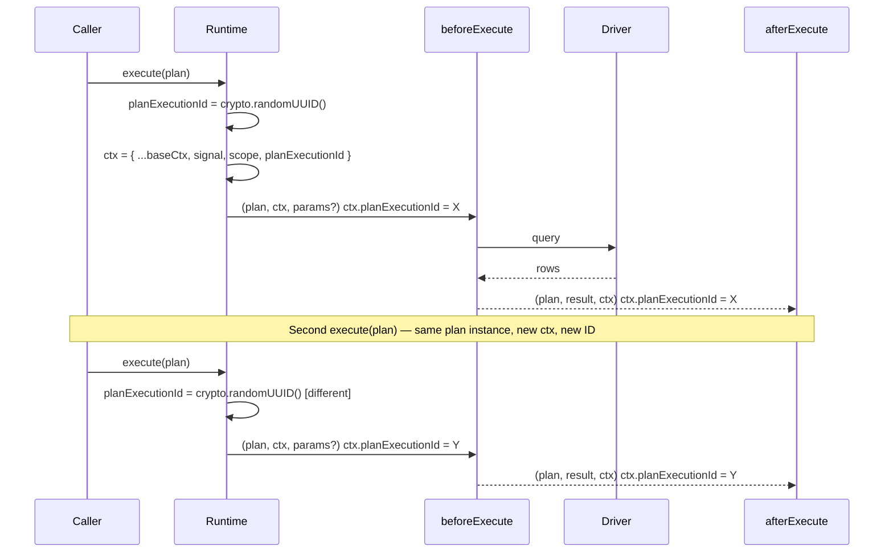

# ADR 220 — Plan execution identity for middleware correlation

## Context

Today's `PlanMeta` carries the contract binding (`storageHash`, `profileHash`), the lane label, and informational metadata like [`groupingKey`](ADR%20160%20-%20Plan%20grouping%20keys%20for%20multi-statement%20orchestration.md). The shared per-operation surface — `RuntimeMiddlewareContext` — carries cancellation (`signal`), the queryable scope (`'runtime' | 'connection' | 'transaction'`), the contract reference, the log sink, and the `contentHash` callable. What neither carries is anything that identifies *this particular execution attempt* of a plan.

Middleware authors keep running into the same gap. A middleware that observes a start hook and wants to correlate the corresponding completion hook — for tracing, timing, audit, or replay — has nothing stable to key on. The hooks fire on the same plan reference, but there is no per-operation identity to thread through external systems (spans, log records, downstream collectors).

[ADR 013 — Lane-agnostic Plan identity and hashing](ADR%20013%20-%20Lane%20Agnostic%20Plan%20Identity.md) defines a content-based `planId` and `sqlFingerprint`. Those identify a *query shape* — two operations of the same plan share them by design. That is the right answer for telemetry de-duplication and cross-lane identity; it is the wrong answer for "which runtime operation am I in?".

[ADR 160 — Plan grouping keys for multi-statement orchestration](ADR%20160%20-%20Plan%20grouping%20keys%20for%20multi-statement%20orchestration.md) introduced `meta.groupingKey` for orchestrator-assigned multi-plan grouping. It is orthogonal: `groupingKey` answers "which higher-level operation does this statement belong to?", and is assigned by the orchestrator that owns the multi-plan flow. We need a sibling concept for the individual runtime-operation lifecycle, owned by the runtime.

## Decision

Add a required `planExecutionId: string` field to `RuntimeMiddlewareContext`. Every runtime operation (`query`, prepared statement `query`, or `execute`) mints a fresh value via `crypto.randomUUID()` and includes it in its middleware context. The same context reference is threaded through that operation's hooks, so every hook fired during one operation observes the same `planExecutionId`. The next operation constructs a new context with a new ID.

```ts
interface RuntimeMiddlewareContext {
  // ... existing fields (contract, mode, now, log, contentHash, signal?, scope) ...
  /** Fresh per runtime operation; same across all hooks within one operation. */
  readonly planExecutionId: string;
}
```



### Semantics

- **Per-operation, not per-plan.** Each runtime operation (`query`, prepared statement `query`, or `execute`) produces a distinct `planExecutionId`. Reuse is a first-class pattern (prepared queries, repeated requests); two operations of the same plan are two events.
- **All hooks for one operation see the same ID.** The query or execute hooks fired during one operation receive the same `ctx` reference and therefore the same `planExecutionId`.
- **The plan flows through unchanged.** The runtime does not wrap the plan to attach identity. The plan reference a caller passes in is the plan reference middleware sees.
- **Excluded from hashing by construction.** `planExecutionId` lives on the context, not the plan, so `computeSqlContentHash` and `computeSqlFingerprint` see nothing to exclude. Two operations of the same plan produce the same content hash and the same fingerprint.

### Why the middleware context, not `PlanMeta`

Metadata lives with the thing it characterises. `PlanMeta` describes the plan: target, storage hash, lane, annotations. Everything on it characterises the *thing being executed*. `planExecutionId` characterises the *runtime operation* — a different lifecycle with a different owner (the runtime, which knows when the operation starts).

Putting it on `PlanMeta` would have several knock-on consequences worth avoiding:

- The runtime would have to wrap the plan to attach the ID, creating a new plan reference on every operation. The contract that "the plan a caller passes in is the plan that flows through the chain" would weaken.
- Plans would appear to "carry" operation identity even though they do not — a caller inspecting `plan.meta` would see a field whose value changes every time the plan is queried or executed.
- Content hashing and fingerprinting would have to consciously exclude the field.
- Tests would have to pin an override-on-operation contract because callers could otherwise pre-set the ID on construction.

`RuntimeMiddlewareContext` is already per-operation, already threaded through every hook, already the home for sibling per-operation facts (`signal`, `scope`). Adding a field is cheaper than inventing a new container, and the placement matches what the field describes.

### Why a flat field, not an `executionMeta` container

Grouping execution-scoped fields under `ctx.executionMeta` was considered and held off:

1. **The existing context fields are already mixed.** `signal`, `scope`, `now` are per-operation facts; `contract`, `mode`, `log`, `contentHash` are runtime-config facilities. We have not grouped them historically, and the type stays scannable today. Adding a container for one new field would be a stylistic precedent without a corresponding group to populate it.
2. **`signal` and `scope` are not "metadata".** `signal` is a control primitive used to *abort*; `scope` is a routing/policy field used to *decide whether* to act. Only identity-style fields would belong under `executionMeta`, and there is one such field today.
3. **The refactor stays cheap.** If additional identity-style fields land later (attempt number, trace IDs, started-at timestamps), the move to `executionMeta` is mechanical: rename fields, update call sites. Holding off today avoids speculative grouping.

`ctx.planExecutionId` reads cleanly at middleware call sites and matches the existing `ctx.signal` / `ctx.scope` shape for runtime operations.

### Why a new field, not `planId`

ADR 013's `planId` is a content hash. It is stable across operations of the same logical query — that is its job. Reusing the name for a per-operation random ID would conflate two distinct concepts. We keep ADR 013's content-based identity intact and add a sibling on the context for operation identity.

### Why a new field, not `groupingKey`

ADR 160's `groupingKey` is orchestrator-assigned and groups *multiple* plans that serve one higher-level operation. It is unrelated to "which runtime operation am I in?" — two plans inside one ORM operation share a `groupingKey` but receive distinct `planExecutionId`s when queried or executed (one per operation). They answer different questions and live in different places (one on `PlanMeta`, one on the context).

### Why `crypto.randomUUID()`

- Standard Web Crypto global, available in every Node version we target — no import needed.
- Synchronous, ~48 ns per call — no measurable overhead in the execute path.
- Cryptographically random (v4 UUID) — no collisions to worry about in any practical workload.
- Opaque to middleware consumers — no schema commitments beyond "a string".

## Implementation

`RuntimeCore.query()` and `RuntimeCore.execute()` in `@internal/framework-components` construct their per-operation contexts at the start of each operation:

```ts
const operationCtx: RuntimeMiddlewareContext = {
  ...this.ctx,
  planExecutionId: crypto.randomUUID(),
};
// Query: runBeforeQueryChain → runQueryWithMiddleware.
// Execute: runBeforeExecuteChain → runExecuteWithMiddleware.
```

`SqlRuntime.queryAgainstQueryable` and `runPreparedQueryAgainstQueryable` construct a per-query middleware context (`execMiddlewareCtx`) that spreads the stored runtime-level ctx with `signal` and `scope`. They gain `planExecutionId: crypto.randomUUID()` in the same spread. The context is shared by the query lifecycle — `beforeQuery`, `interceptQuery`, `onRow`, and `afterQuery` — for both ordinary and prepared queries.

`MongoRuntimeImpl.query` and `execute` construct their own per-operation contexts with the same shape. The pattern is uniform across runtimes; family-specific detail is that SQL and Mongo override these operations and do not delegate to `super`, so the assignment happens at each entry point.

## Consequences

### Positive

- Middleware authors correlate matching before/after hooks for the same query, prepared statement `query`, or execute call by reading `ctx.planExecutionId`.
- Two operations of the same plan are observably distinct events.
- Identity lives where the lifecycle lives; plans, plan builders, and content hashing are unaffected.
- The plan reference flows through the pipeline unchanged.

### Trade-offs

- Family runtimes that implement runtime operation entry points (`query`, prepared statement `query`, or `execute`) must remember to include `planExecutionId` in each per-operation ctx spread. Tests pin the property at every runtime entry point; a future family runtime must add it to each operation it implements.
- `RuntimeMiddlewareContext` gains a required field, so every consumer that constructs a context literal (test fixtures, alternative runtime implementations) must include it. The migration is mechanical.

## Alternatives considered

- **Put `planExecutionId` on `PlanMeta`.** Rejected — would tie identity to the plan instance, force plan wrapping at operation entry, complicate content hashing, and require an override-on-operation contract for caller-supplied values. The field describes a runtime operation, not a plan.
- **`executionMeta` container on `RuntimeMiddlewareContext`.** Considered and held off — a single operation-identity field today does not pay for the container; reintroduce it if the per-operation identity surface grows.
- **Reuse ADR 013's `planId`.** Rejected — different concept. Content-based identity is per-query-shape; operation identity is per runtime operation.
- **Per-hook ID parameter.** Add `planExecutionId` as an extra argument to every middleware hook signature. Rejected — changes the hook API surface for a value the existing context already serves naturally.
- **`AsyncLocalStorage` for execution context.** Rejected — implicit propagation conflicts with the codebase's "explicit over implicit" stance (cf. ADR 160's reasoning for `groupingKey`).

## References

- [ADR 013 — Lane-agnostic Plan identity and hashing](ADR%20013%20-%20Lane%20Agnostic%20Plan%20Identity.md)
- [ADR 014 — Runtime Hook API](ADR%20014%20-%20Runtime%20Hook%20API.md)
- [ADR 160 — Plan grouping keys for multi-statement orchestration](ADR%20160%20-%20Plan%20grouping%20keys%20for%20multi-statement%20orchestration.md)
- [ADR 215 — Runtime middleware lifecycle: `beforeExecute` fires before `encodeParams`](ADR%20215%20-%20Runtime%20middleware%20lifecycle%20beforeExecute%20before%20encodeParams.md)
