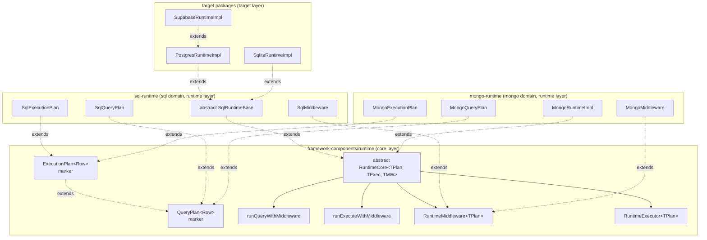
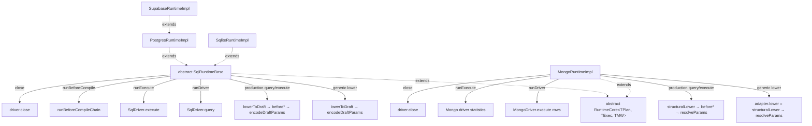
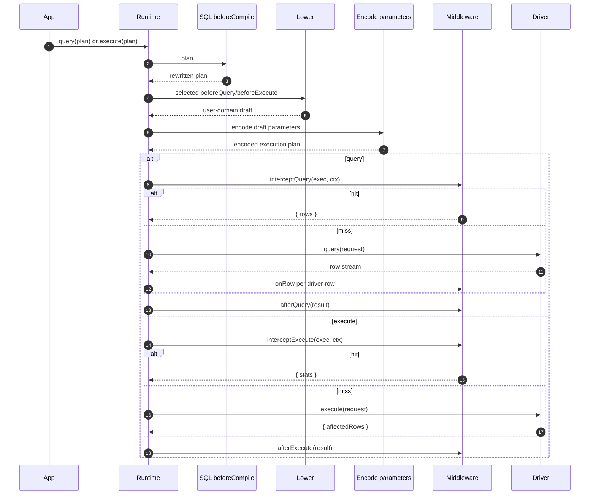

# Runtime & Middleware Framework

The runtime is the executable core of Prisma Next. Its job is to execute query plans and deliver tight feedback loops as it does so. Like the other subsystems, the runtime is simply an orchestrator of composable, primitive components responsible for execution, verification, and the middleware system.

Every query is compiled into a Plan, every Plan passes through the family-agnostic middleware lifecycle defined by `RuntimeCore`, and post-lowering middleware orchestration is delegated to canonical operation-specific helpers. This makes behavior explicit and problems easy to diagnose.

The "one query, one statement" rule simplifies both verification and debugging. When a Plan fails verification or a middleware raises a violation, the surface area is small and the cause is clear.

Results stream as `AsyncIterable<Row>` so applications can start processing immediately without buffering entire result sets. For typical small queries, consumers can opt into simple collection; the streaming model is the default, not a requirement.

The middleware system keeps logic out of the core and makes behavior composable. First-party and community middleware can implement lints, budgets, telemetry, and AST rewrites. Every Plan is presented to middleware before execution so policies and checks run consistently across families.

The runtime also verifies the contract against the database marker before it executes, and it executes Plans via family drivers while composing codecs from adapters and packs to decode rows precisely.

The runtime does not orchestrate migrations or unit-of-work semantics, does not contain dialect lowering logic (which lives in adapters), does not parse arbitrary SQL beyond the structure provided by lanes, and does not allow disabling contract verification in production. This separation of concerns reflects a thin-core, fat-targets philosophy that keeps the core predictable and extensions explicit.

## Single-Tier Runtime Model

Prisma Next has a single-tier runtime model: each family runtime is a single class that extends an abstract framework base. There is no separate target-agnostic "runtime executor" package any more — the framework owns the lifecycle template and the middleware orchestrator, and family runtimes own their family-specific overrides. See [ADR 204 — Single-tier runtime: collapse `runtime-executor` into `framework-components`](../adrs/ADR%20204%20-%20Single-tier%20runtime.md) for the rationale and the dependency direction it establishes.

The cross-family abstractions live in [`@internal/framework-components/runtime`](../../../packages/1-framework/1-core/framework-components/src/exports/runtime.ts):

- Plan markers — `QueryPlan` and `ExecutionPlan` (see [`query-plan.ts`](../../../packages/1-framework/1-core/framework-components/src/execution/query-plan.ts)).
- Middleware SPI — `RuntimeMiddleware<TPlan>`, `RuntimeMiddlewareContext`, `AfterExecuteResult` (see [`runtime-middleware.ts`](../../../packages/1-framework/1-core/framework-components/src/execution/runtime-middleware.ts)).
- Executor SPI — `RuntimeExecutor<TPlan>` (same module).
- Abstract base — `RuntimeCore<TPlan, TExec, TMiddleware>` (see [`runtime-core.ts`](../../../packages/1-framework/1-core/framework-components/src/execution/runtime-core.ts)).
- Lifecycle helpers — `runBeforeQueryChain`, `runBeforeExecuteChain`, `runQueryWithMiddleware`, and `runExecuteWithMiddleware` (see [`execution/`](../../../packages/1-framework/1-core/framework-components/src/execution/)).

The class hierarchy has three layers: framework → family → target. Target classes are where construction happens (via target factories) and where target-specific runtime behaviour lives.



## Plan Markers: `QueryPlan` and `ExecutionPlan`

`QueryPlan<Row>` and `ExecutionPlan<Row>` are content-free framework-level marker interfaces. They exist so generic SPIs (`RuntimeExecutor`, `RuntimeMiddleware`, the abstract base, the orchestrator helper) can be parameterized over a plan type without naming any family-specific shape.

```typescript
// packages/1-framework/1-core/framework-components/src/execution/query-plan.ts
export interface QueryPlan<Row = unknown> {
  readonly meta: PlanMeta;
  readonly _row?: Row;
}

export interface ExecutionPlan<Row = unknown> extends QueryPlan<Row> {}
```

`QueryPlan` is the **pre-lowering** marker — what a query lane builds. `ExecutionPlan` is the **post-lowering** marker — what a family runtime hands to the driver. Each family extends them with its concrete payload:

- `SqlQueryPlan` — AST + meta (no SQL text yet). Lives in [`@internal/sql-relational-core`](../../../packages/2-sql/4-lanes/relational-core/src/plan.ts) (lanes layer; lanes can build it without a runtime dependency).
- `SqlExecutionPlan` — `{ sql, params, ast?, meta, _row? }`. Lives in [`@internal/sql-relational-core`](../../../packages/2-sql/4-lanes/relational-core/src/sql-execution-plan.ts) and is re-exported from `@internal/sql-runtime` via `./plan`. Co-located with `SqlQueryPlan` so lane utilities (`RawTemplateFactory`, `RawFactory`, `SqlPlan`) can compose against the executable shape without depending on the runtime layer.
- `MongoQueryPlan` — typed Mongo command shape; lives in [`@internal/mongo-query-ast`](../../../packages/2-mongo-family/4-query/query-ast/src/query-plan.ts).
- `MongoExecutionPlan` — `{ command, meta, _row? }`. Lives in [`@internal/mongo-runtime`](../../../packages/2-mongo-family/7-runtime/src/mongo-execution-plan.ts) (runtime layer; the wire-command shape lives in transport, which the lanes layer cannot depend on).

The framework domain owns no SQL- or Mongo-shaped concrete plan type. The previous SQL-shaped `ExecutionPlan` that lived in `@internal/contract/types` has been replaced by these family-specific subtypes.

The phantom `_row` on every plan lets type-level utilities recover the row type from a plan value (`type Row = ResultType<typeof plan>`), and lets `RuntimeExecutor.query<Row>(plan: TPlan & { readonly _row?: Row })` thread a caller-supplied `Row` into the result stream. `RuntimeExecutor.execute(plan)` is the separate statistics operation.

## Abstract `RuntimeCore` Lifecycle Template

`RuntimeCore<TPlan, TExec, TMiddleware>` provides the family-agnostic operation split. Concrete subclasses provide lowering and driver terminals; the framework keeps row and statistics lifecycles explicit.

```typescript
// packages/1-framework/1-core/framework-components/src/execution/runtime-core.ts
export abstract class RuntimeCore<
  TPlan extends QueryPlan,
  TExec extends ExecutionPlan,
  TMiddleware extends RuntimeMiddleware<TExec>,
> implements RuntimeExecutor<TPlan> {
  protected abstract lower(plan: TPlan, ctx: CodecCallContext): TExec | Promise<TExec>;
  protected abstract runDriver(exec: TExec): AsyncIterable<Record<string, unknown>>;
  protected abstract runExecute(exec: TExec): Promise<RuntimeStatementStats>;
  abstract close(): Promise<void>;

  query<Row>(plan: TPlan & { readonly _row?: Row }): AsyncIterableResult<Row>;
  execute(plan: TPlan): Promise<RuntimeStatementStats>;
}
```

`RuntimeCore` provides the generic ordering: `runBeforeCompile` → `lower` to the executable `TExec` → the matching before hook → the matching middleware runner. It does not own parameter encoding or a pre-encode draft. SQL and Mongo override their production operation paths to place their family-specific split before encoding: the selected before hook mutates a structural draft, then SQL calls `encodeDraftParams` or Mongo calls `resolveParams`. Interceptors therefore observe the encoded execution plan on those paths. `runDriver` is the row/query terminal and `runExecute` is the statistics terminal; both are required abstract driver seams alongside `lower` and `close`.

`close()` is abstract; subclasses dispose family-specific resources. The runtime context is shared by all hooks in one operation and carries no operation discriminator — hook selection and result types carry that distinction.

## Family and Target Inheritance Pattern

Each family runtime binds the three generics to concrete family types and implements the family-specific overrides. Target classes extend the family class to add target-specific runtime behaviour; there is no two-layer composition — no outer "family runtime" wrapping an inner "runtime core" instance.



**SQL family.** [`SqlRuntimeBase extends RuntimeCore<SqlQueryPlan, SqlExecutionPlan, SqlMiddleware>`](../../../packages/2-sql/5-runtime/src/sql-runtime.ts) is **abstract** and overrides:

- `lower(plan: SqlQueryPlan, ctx: SqlCodecCallContext): SqlExecutionPlan` — composes `lowerToDraft` and `encodeDraftParams` for the abstract `RuntimeCore` contract. The production query and execute helpers instead call `lowerToDraft`, run the selected `beforeQuery` or `beforeExecute` chain, and then call `encodeDraftParams` so mutations are encoded afterward.
- `runDriver(exec: SqlExecutionPlan): AsyncIterable<Record<string, unknown>>` — the row/query path, delegating to `SqlDriver.query()`.
- `runExecute(exec: SqlExecutionPlan): Promise<SqlStatementStats>` — the statistics path, delegating to `SqlDriver.execute()`.
- `runBeforeCompile(plan: SqlQueryPlan): Promise<SqlQueryPlan>` — runs the `beforeCompile` chain over the plan's draft (AST + meta), returning a rewritten plan when middleware mutates the AST.
- `close()` — closes the driver pool.

`SqlRuntimeBase` wraps its query path with codec row-decoding and wraps both query and execute with marker verification and telemetry fingerprinting; these stay SQL-side rather than living in the abstract base.

`SqlRuntimeBase` also exposes a raw-connection primitive and separate protected query/statistics helpers for target subclasses that need to issue SQL outside the middleware chain — see [Raw Connection Seam](#raw-connection-seam) below.

**SQL target classes.** [`PostgresRuntimeImpl`](../../../packages/3-extensions/postgres/src/runtime/postgres-runtime.ts) and [`SqliteRuntimeImpl`](../../../packages/3-extensions/sqlite/src/runtime/sqlite-runtime.ts) extend `SqlRuntimeBase` and are currently identity-thin — their value is structural. Future Postgres-specific runtime behaviour (prepared-statement caching, `LISTEN`/`NOTIFY`, etc.) lands on `PostgresRuntimeImpl` and flows into `SupabaseRuntimeImpl` by inheritance.

Target factories (`postgres()`, `sqlite()`, `supabase()`) construct their concrete target class; app code receives the `Runtime` interface and never sees the class hierarchy.

**Mongo family.** [`MongoRuntimeImpl extends RuntimeCore<MongoQueryPlan, MongoExecutionPlan, MongoMiddleware>`](../../../packages/2-mongo-family/7-runtime/src/mongo-runtime.ts) overrides:

- `lower(plan: MongoQueryPlan): MongoExecutionPlan` — composes the adapter's one-shot `lower`, which is `resolveParams(structuralLower(plan))`, for the abstract `RuntimeCore` contract. The production query and execute paths call `structuralLower`, run the selected before hook, and then call `resolveParams`.
- `runDriver(exec: MongoExecutionPlan): AsyncIterable<Record<string, unknown>>` — drives the driver's row/query stream via `driver.execute(exec.command)`.
- `runExecute(exec: MongoExecutionPlan): Promise<RuntimeStatementStats>` — drives the statistics path and maps update `modifiedCount` or delete `deletedCount`.
- `close()` — closes the driver.

Mongo does not override `runBeforeCompile`; the base's identity default is sufficient because Mongo has no typed AST-rewrite chain today.

Adding a new family runtime requires one constructor and four abstract method overrides (`lower`, `runDriver`, `runExecute`, and `close`; `runBeforeCompile` is an optional fifth override when the family wants typed pre-lowering rewrites). No other extension points are required.

## Raw Connection Seam

`SqlRuntimeBase` exposes a raw-connection primitive and separate protected query/statistics helpers for target subclasses that need to run SQL outside the middleware chain — for example, to apply session-scoped Postgres settings before a typed query runs.

```ts
protected acquireRawConnection(): Promise<SqlConnection>

protected queryAgainstQueryable<Row>(
  plan: SqlExecutionPlan<unknown> | SqlQueryPlan<unknown>,
  queryable: SqlQueryable,
  options?: RuntimeExecuteOptions,
): AsyncIterableResult<Row>

protected executeStatisticsAgainstQueryable(
  plan: SqlExecutionPlan<unknown> | SqlQueryPlan<unknown>,
  queryable: SqlQueryable,
  options?: RuntimeExecuteOptions,
): Promise<SqlStatementStats>
```

`acquireRawConnection()` returns a raw `SqlConnection` from the driver. SQL issued directly on it (e.g. via `conn.query(...)`) runs outside the middleware/codec/telemetry pipeline. The caller owns the connection's lifecycle (`release`/`destroy`/`beginTransaction`).

`queryAgainstQueryable()` runs a typed row plan through the full middleware/codec/telemetry pipeline against a caller-supplied queryable, while `executeStatisticsAgainstQueryable()` runs the corresponding statistics path. Passing the raw connection from `acquireRawConnection` lets a subclass issue its setup SQL first, then hand the same connection to the appropriate helper.

**Why below-middleware matters.** SQL issued on the raw connection runs outside the operation-specific middleware helpers. User middleware cannot observe, reorder, or strip it. This makes setup SQL structurally non-bypassable — the property that makes Postgres RLS role enforcement sound.

[`SupabaseRuntimeImpl`](../../../packages/3-extensions/supabase/src/runtime/supabase-runtime.ts) is the canonical user: its `openRoleSession` method acquires a raw connection and issues `SELECT set_config('role', ...)` and `SELECT set_config('request.jwt.claims', ...)` before handing the connection to the typed query path.

## Operation-specific middleware helpers

The framework provides one canonical runner for each terminal. `runQueryWithMiddleware` owns `interceptQuery`, the driver row source, `onRow`, and `afterQuery`. `runExecuteWithMiddleware` owns `interceptExecute`, the statistics-producing driver call, and `afterExecute`. `runBeforeQueryChain` and `runBeforeExecuteChain` are called by family runtimes before parameter encoding so their optional family mutators can affect the final request. Family runtimes do not reimplement these loops.

```typescript
// packages/1-framework/1-core/framework-components/src/execution/run-with-middleware.ts
export function runQueryWithMiddleware<TExec extends ExecutionPlan, Row>(...): AsyncIterableResult<Row>;
export function runExecuteWithMiddleware<TExec extends ExecutionPlan>(...): Promise<RuntimeStatementStats>;
```

The operation-specific lifecycles are:

- **Query:** `beforeQuery` → encode parameters → `interceptQuery` → driver `query` or intercepted rows → `onRow` for driver rows → `afterQuery`.
- **Execute:** `beforeExecute` → encode parameters → `interceptExecute` → driver `execute` or intercepted statistics → `afterExecute`.

Each chain runs middleware in registration order. The first non-`undefined` interceptor wins within its operation. Query interception returns `{ rows }` and skips the driver and `onRow`; execute interception returns `{ stats }` and skips only the driver terminal. Both completion hooks receive `source: 'driver' | 'middleware'`; error-path after-hook failures are swallowed so they do not mask the original operation error.

## Intercepting Execution

Interception is operation-specific. `interceptQuery` can short-circuit a row query with `{ rows }`; `interceptExecute` can short-circuit a statistics execution with `{ stats }`. Each hook runs after its matching before hook and after parameter encoding. Middleware runs in registration order and the first non-`undefined` result wins. A query hit skips the driver and `onRow`; an execute hit skips only the driver execute call. Both matching after hooks still run with `source: 'middleware'`.

```typescript
interface QueryInterceptResult {
  readonly rows: AsyncIterable<Record<string, unknown>> | Iterable<Record<string, unknown>>;
}

interface ExecuteInterceptResult {
  readonly stats: RuntimeStatementStats;
}
```

The context has no `operation` discriminator. A middleware that handles both operations implements both hook names, and the type of the result prevents a query interceptor from supplying statistics or an execute interceptor from supplying rows. The query cache uses `interceptQuery`; it does not participate in execute interception.

Contract-marker verification remains upstream of SQL interception, so an interceptor cannot bypass a stale-contract check. Errors raised by an interceptor, driver, or query row source invoke the matching after hook with `completed: false`; after-hook errors on that path are swallowed. Before-hook failures happen before the managed runner and do not invoke an after hook.

The post-lowering execution plan is fresh for each operation. Middleware that keys per-execution scratch state by plan identity can therefore use a `WeakMap` without leaking rows between concurrent calls. See [ADR 025 — Plan caching & memoization](../adrs/ADR%20025%20-%20Plan%20Caching%20Memoization.md).

## Annotations

Annotations are a typed, namespaced way to attach per-query metadata that middleware can read. They are the opt-in mechanism the cache middleware uses ("cache this read for 60 seconds"), the audit middleware would use ("attribute this write to this actor"), and any future per-query policy hook will reuse.

The framework provides three pieces:

- `OperationKind = 'read' | 'write'` — the binary discriminator that gates which terminals an annotation can attach to. Finer-grained kinds (`'select' | 'insert' | …`) are deferred; widening is additive.
- `defineAnnotation<Payload>()({ namespace, applicableTo })` — curried two-step factory. The first call takes `Payload` explicitly; the second takes the runtime options and infers `Kinds` from `applicableTo` via a `const` type parameter, so the operation kinds appear once at the call site rather than being repeated as a type argument. The returned handle is a **callable function**: `handle(value)` produces an `AnnotationValue<Payload, Kinds>`. The function also carries `namespace`, `applicableTo: ReadonlySet<Kinds>` (frozen), and `read(plan)` as properties. Both `applicableTo` (off the handle and off each value) feed the type-level and runtime applicability gates.
- `ValidAnnotations<K, As>` — mapped tuple type consumed by lane terminals. Resolves any tuple element whose declared `Kinds` does not include the terminal's `K` to `never`, surfacing the mismatch as a type error at the call site.

```typescript
// packages/1-framework/1-core/framework-components/src/annotations.ts
import { defineAnnotation } from '@internal/framework-components/runtime'

// Read-only annotation. Kinds inferred as 'read'.
export const cacheAnnotation = defineAnnotation<{ ttl?: number }>()({
  namespace: 'cache',
  applicableTo: ['read'],
})

// Write-only annotation (illustrative). Kinds inferred as 'write'.
export const auditAnnotation = defineAnnotation<{ actor: string }>()({
  namespace: 'audit',
  applicableTo: ['write'],
})

// Applicable to both kinds (e.g. tracing). Kinds inferred as 'read' | 'write'.
export const otelAnnotation = defineAnnotation<{ traceId: string }>()({
  namespace: 'otel',
  applicableTo: ['read', 'write'],
})
```

**Lane integration.** SQL DSL and ORM `Collection` adopt different surface shapes appropriate to their idioms; both gate by the terminal's operation kind `K`:

- SQL DSL — `.annotate(...)` is a variadic chainable method on every builder kind: `SelectQueryImpl` / `GroupedQueryImpl` accept `'read'`-applicable annotations; `InsertQueryImpl` / `UpdateQueryImpl` / `DeleteQueryImpl` accept `'write'`-applicable. The variadic parameter is constrained by `As & ValidAnnotations<K, As>`. The intersection is load-bearing — TypeScript's variadic-tuple inference is too forgiving with `ValidAnnotations<K, As>` alone, but the intersection pins `As` to the call-site tuple AND requires assignability to the gated form.
- ORM `Collection` and `GroupedCollection` — every terminal accepts an optional `configure: (meta: MetaBuilder<K>) => void` callback as its last argument. The user calls `meta.annotate(annotation)` (chainable, returns the builder) once per annotation; the conditional `K extends Kinds ? AnnotationValue<P, Kinds> : never` parameter type rejects inapplicable annotations at the call site. There is no chainable `Collection.annotate()` — annotations attach via the configurator only. The callback shape (rather than the variadic shape SQL DSL uses) is deliberate at the ORM layer: a terminal's last argument grows over time (future per-call options), and a callback configurator is extension-friendly where a variadic forecloses on additional arguments. The callback also drops the load-bearing `As & ValidAnnotations<K, As>` intersection — taking one annotation at a time avoids variadic-tuple inference entirely.

**Runtime applicability check.** SQL DSL `.build()` and the ORM `MetaBuilder.annotate(...)` both call `assertAnnotationsApplicable(...)` against the annotation(s) and the terminal's kind. The helper throws `RUNTIME.ANNOTATION_INAPPLICABLE` naming the namespace and terminal on any annotation whose `applicableTo` set lacks `kind`. This is belt-and-suspenders: the type system fails closed for type-aware callers, and the runtime check fails closed for casts / `any` / dynamic invocations. ORM terminals construct the meta builder via `createMetaBuilder(kind, terminalName)` and let the builder's `annotate` perform the gate eagerly; lane code does not re-validate after the user callback returns.

**Storage.** Applied annotations land under `plan.meta.annotations[namespace]` as branded `AnnotationValue<Payload, Kinds>` objects. Multiple `.annotate()` chain calls (SQL DSL) or `meta.annotate(...)` calls inside the configurator (ORM) compose; duplicate namespaces use last-write-wins. Reading via `handle.read(plan)` defensively checks the `__annotation` brand so framework-internal metadata (e.g. `meta.annotations.codecs` written by the SQL emitter) is not mistaken for a user annotation.

**Reserved namespaces.** `codecs` is consumed by the SQL emitter (`meta.annotations.codecs[alias] = 'pg/text@1'`) and read by the SQL runtime's `decodeRow`; it must not be used by user handles. Target-specific keys such as `pg` are similarly reserved. `defineAnnotation` does not structurally prevent a user from naming a reserved namespace — handles are namespaced strings, not branded types — but the framework makes no compatibility guarantees about handles that do.

**Runtime context: `contentHash` and `scope`.** Two `RuntimeMiddlewareContext` fields support the annotation-driven middleware ecosystem:

- `contentHash(exec): Promise<string>` — the family runtime returns an opaque, bounded digest identifying the `(storage, statement, params)` tuple of an execution. SQL composes `meta.storageHash + '|' + exec.sql + '|' + canonicalStringify(exec.params)` and pipes through `hashContent` (SHA-512); Mongo composes `meta.storageHash + '|' + canonicalStringify(exec.command)` and pipes the same way. Two semantically equivalent executions return the same digest. Used by middleware that need per-execution identity (caching, request coalescing). The cache middleware uses the returned string directly as a `Map` key — it is not (and should not be) further hashed by callers.
- `scope: 'runtime' | 'connection' | 'transaction'` — discriminates the queryable surface the execution is running under. Top-level `runtime.execute` populates `'runtime'`; `connection.execute` and `transaction.execute` derive a context with `'connection'` / `'transaction'`. Middleware that should only act at the top level (e.g. the cache middleware) read this field to bypass non-runtime scopes.

## ORM Client Integration

The SQL ORM client ([`@internal/sql-orm-client`](../../../packages/3-extensions/sql-orm-client/src/types.ts)) consumes the canonical executor interface rather than declaring a parallel hierarchy. The integration is anchored on a small `RuntimeScope` slice exported from the lanes layer so both the ORM client and the SQL runtime depend on the same source of truth:

```typescript
// packages/2-sql/4-lanes/relational-core/src/runtime-scope.ts
import type { AsyncIterableResult, RuntimeExecuteOptions } from '@internal/framework-components/runtime';
import type { SqlStatementStats } from './ast/driver-types';
import type { SqlExecutionPlan } from './sql-execution-plan';
import type { SqlQueryPlan } from './plan';

export type SqlOrmPlan = SqlExecutionPlan | SqlQueryPlan;

export interface RuntimeScope {
  query<Row>(plan: SqlOrmPlan, options?: RuntimeExecuteOptions): AsyncIterableResult<Row>;
  execute(plan: SqlOrmPlan, options?: RuntimeExecuteOptions): Promise<SqlStatementStats>;
}
```

```typescript
// packages/3-extensions/sql-orm-client/src/types.ts
import type { RuntimeScope, SqlOrmPlan } from '@internal/sql-relational-core';

export interface RuntimeQueryable extends RuntimeScope {
  connection?(): Promise<RuntimeConnection>;
  transaction?(): Promise<RuntimeTransaction>;
}

export interface RuntimeConnection extends RuntimeScope { /* release?, transaction? */ }
export interface RuntimeTransaction extends RuntimeScope { /* commit?, rollback? */ }
```

`RuntimeQueryable` is `RuntimeScope` plus optional SQL-domain `connection()` / `transaction()` methods; `RuntimeConnection` and `RuntimeTransaction` extend `RuntimeScope` with their lifecycle methods. The structural compatibility with `RuntimeExecutor<SqlOrmPlan>` is asserted by the type test at [`runtime-queryable.types.test-d.ts`](../../../packages/3-extensions/sql-orm-client/test/runtime-queryable.types.test-d.ts).

The SQL `Runtime` interface returned by target factories such as `postgres()` (in [`@internal/sql-runtime`](../../../packages/2-sql/5-runtime/src/sql-runtime.ts)) extends the same `RuntimeScope` from `@internal/sql-relational-core`; the type test pins this invariant.

## Example

```typescript
import postgres from '@internal/postgres/runtime'
import { schema } from '@internal/sql-relational-core/schema'
import { validateContract } from '@internal/sql-contract/validate'
import type { Contract } from './contract.d'
import contractJson from './contract.json' with { type: 'json' }

const contract = validateContract<Contract>(contractJson)

const db = postgres({ url: process.env.DATABASE_URL, contract })
await db.connect()

const tables = schema(db.context).tables

const plan = db.sql
  .from(tables.user)
  .where(tables.user.columns.active.eq(true))
  .select({ id: tables.user.columns.id, email: tables.user.columns.email })
  .build()

for await (const row of db.runtime().query(plan)) {
  console.log(row.id, row.email)
}

const stats = await db.runtime().execute(
  db.sql.from(tables.user).where(tables.user.columns.active.eq(false)).update({ active: true }).build(),
)
console.log(stats.affectedRows)
```

### Sequence (high level)

The runtime compiles and lowers once for the selected operation, verifies the SQL marker before the terminal, and then runs the matching middleware lifecycle. Query terminals stream and decode rows; execute terminals resolve actual statement statistics.



## Plans, Identity, and Verification

Plans are immutable execution units produced by lanes. A `SqlExecutionPlan` carries `sql`, `params`, an optional `ast`, and `meta`; a `MongoExecutionPlan` carries `command` and `meta`. Treating Plans as the product — rather than executing intent directly — keeps behavior explicit, hashable, and auditable across environments. See the unified Plan model in Query Lanes and [ADR 011 — Unified Plan model across lanes](../adrs/ADR%20011%20-%20Unified%20Plan%20Model.md).

```typescript
type PlanMeta = {
  target: string
  storageHash: string
  profileHash?: string
  lane?: string
  refs?: { tables: string[]; columns: Array<{ table: string; column: string }> }
  projection?: Record<string, string>
  annotations?: Record<string, unknown>
}

interface SqlExecutionPlan<Row = unknown> extends ExecutionPlan<Row> {
  readonly sql: string
  readonly params: readonly unknown[]
  readonly ast?: AnyQueryAst   // optional; present for DSL/ORM lanes
}

interface MongoExecutionPlan<Row = unknown> extends ExecutionPlan<Row> {
  readonly command: AnyMongoWireCommand
}
```

AST is optional and present only for SQL lanes that build one (DSL/ORM). Raw and TypedSQL lanes omit it and rely on annotations and refs.

Verification compares the runtime's loaded contract to the database marker. Both `storageHash` and `profileHash` are enforced:

- The runtime reads marker `{ storageHash, profileHash }` and compares them to the loaded contract's hashes.
- A mismatch results in `contract/hash-mismatch` or `contract/marker-missing`, depending on configuration. See [ADR 021](../adrs/ADR%20021%20-%20Contract%20Marker%20Storage.md).
- `profileHash` is derived solely from the contract and written by the migration runner; the runtime does not compute a new profile or "negotiate" a new hash. See [ADR 004 — Storage Hash vs Profile Hash](../adrs/ADR%20004%20-%20Storage%20Hash%20vs%20Profile%20Hash.md).

## Affected-row semantics by target

The `execute()` terminal returns the target driver's statistic; it does not normalize different database definitions of an affected row.

- **Postgres:** the driver maps `pg`'s result `rowCount` from the command-complete tag to `affectedRows`. For `INSERT`, `UPDATE`, and `DELETE`, this is the number of rows matched by the command, including rows whose new values are the same as their old values. See [`postgres-driver.ts`](../../../packages/3-targets/7-drivers/postgres/src/postgres-driver.ts) and its `rowCount` test.
- **SQLite:** the driver prepares a non-row-returning statement, calls `StatementSync.run()`, and maps its `changes` value to `affectedRows`. Node exposes this as SQLite's `sqlite3_changes64()` result, so it reports rows changed by the statement rather than Postgres-style matched rows. Statements with result columns, including `RETURNING`, are rejected on this terminal; use `query()` for rows. See [`sqlite-driver.ts`](../../../packages/3-targets/7-drivers/sqlite/src/sqlite-driver.ts).
- **MongoDB:** Mongo is not a `SqlQueryable`, but its cross-family `execute()` follows the same statistics vocabulary. Update commands map MongoDB's `modifiedCount` to `affectedRows`; delete commands map `deletedCount`. A no-op update can therefore return zero even when a document matched.

These differences are observable application semantics. Count-returning ORM terminals expose the target's value rather than translating it into a cross-target definition.

## Execution Pipeline

The runtime executes Plans through the small set of well-defined stages defined by `RuntimeCore`. The generic base lowers to an executable plan before invoking the matching before hook. SQL and Mongo production paths refine that family hook by splitting structural lowering from parameter encoding or resolution, so middleware can mutate user-domain parameter values first. Each selected operation then runs its own interception, driver, row/statistics, and after stages.

```text
Generic RuntimeCore path
TPlan
  └─▶ runBeforeCompile (family override or identity)
       └─ lower → TExec
           └─▶ beforeQuery or beforeExecute
               └─▶ matching middleware runner → driver terminal / intercepted result

SQL and Mongo production split
TPlan
  └─▶ family compile step (SQL beforeCompile; Mongo identity)
       └─ structural lower → beforeQuery or beforeExecute
           └─ encode/resolve parameters → interceptQuery or interceptExecute
               ├─ query: driver query → onRow → afterQuery
               └─ execute: driver execute → afterExecute
```

- AST lanes lower to a single SQL statement (1q1s) for predictability and guardrails; multi-step behavior is expressed explicitly outside the runtime. See [ADR 016 — Adapter SPI for lowering](../adrs/ADR%20016%20-%20Adapter%20SPI%20for%20Lowering.md) and the Architecture Overview's "Plans are the product".
- Results are `AsyncIterable<Row>` by default; an `AsyncIterableResult.toArray()` helper can collect.
- Budgets (row/latency) enforce incrementally and can terminate streaming early ([ADR 023](../adrs/ADR%20023%20-%20Budget%20Evaluation.md)).
- Prefer reading lane/adapter refs and annotations over parsing SQL text; behavior is explicit, not inferred.

## Connection Lifecycle

The runtime does not own pooling or sockets; it delegates to a target driver. This thin-core approach keeps the runtime simple and stable while adapters and packs carry dialect and capability logic.

**Lifecycle:** instantiate stack with driver → connect at boundary → create runtime ([ADR 159](../adrs/ADR%20159%20-%20Driver%20Terminology%20and%20Lifecycle.md)).

1. Create
   - `createSqlExecutionStack({ target, adapter, driver, extensions })` - Creates SQL descriptor stack.
   - `createExecutionContext({ contract, stack })` - Creates context from contract and descriptors-only stack. Context creation uses descriptor `SqlStaticContributions` (codecs, operation signatures, parameterized codecs) — no instantiation required.
   - `instantiateExecutionStack(stack)` - Instantiates all components including driver (unbound).
   - Caller resolves binding from options and calls `driver.connect(binding)` at the boundary where env is available.
   - Target factory (e.g. `postgres()`) constructs `new PostgresRuntimeImpl({ context, adapter, driver, verifyMarker, middleware })` — a concrete subclass of `SqlRuntimeBase` / `RuntimeCore`. There is no family-level `createRuntime` factory.
   - Validates `contract.json` and caches `storageHash` / `profileHash` (contract is already validated before being passed to context).
   - Discovers environment capabilities to validate against the contract's pinned capability profile; does not compute a new `profileHash` ([ADR 065 — Adapter capability schema & negotiation](../adrs/ADR%20065%20-%20Adapter%20capability%20schema%20&%20negotiation%20v1.md)).
   - Uses `ExecutionContext` for contract, codec, and operations registries (decoupled from runtime).
   - Validates middleware compatibility (familyId / targetId) via `checkMiddlewareCompatibility` and registers middleware in order.
2. Warmup
   - Optional `driver.warmup()` and built-in contract verification if configured.
   - Codecs and operations are composed in `ExecutionContext` from adapter and extensions programmatically ([ADR 030](../adrs/ADR%20030%20-%20Result%20decoding%20&%20codecs%20registry.md), [ADR 114](../adrs/ADR%20114%20-%20Extension%20codecs%20&%20branded%20types.md)).
3. Acquire
   - On first execute, the driver acquires a pooled connection / session.
4. Execute
   - The caller selects `query(plan)` for rows or `execute(plan)` for statistics. The runtime runs shared `beforeCompile`, the selected before hook, encoding, the matching interceptor, and then either the matching driver terminal or the intercepted result. Query rows pass through `onRow` and `afterQuery`; execute statistics pass through `afterExecute`.
5. Release
   - The driver returns the connection to the pool.
6. Shutdown
   - `runtime.close()` closes the driver and disposes middleware resources.

## Transactions

Target clients expose a callback-based `transaction(callback)` API for grouping operations into an atomic unit. Implementation lives once in `@internal/sql-runtime` as `withTransaction(...)`; family clients (e.g. `PostgresClient`) re-export it as `db.transaction(...)` and may override with custom semantics if needed.

```typescript
const result = await db.transaction(async (tx) => {
  await tx.orm.account.where({ id: fromId }).update({ balance: fromBalance - amount })
  await tx.orm.account.where({ id: toId   }).update({ balance: toBalance   + amount })

  const plan = tx.sql.from(tables.auditLog).insert({ action: 'transfer', amount }).build()
  await tx.execute(plan)

  return /* anything */
})
```

The callback receives a `TransactionContext` (`tx`) with three slots, all bound to the same transaction-scoped connection:

- `tx.orm` — ORM client (same `Collection<...>` shape as `db.orm`).
- `tx.sql` — SQL builder (same `Db<TContract>` shape as `db.sql`).
- `tx.query(plan)` — lazy row streaming against the transaction's connection.
- `tx.execute(plan)` — eager statement statistics against the transaction's connection.

`tx` deliberately does **not** carry a `transaction` method — nesting is a compile-time error.

### Lifecycle and connection scoping

The runtime acquires a connection (auto-connecting lazily, like `db.runtime()`), issues `BEGIN`, runs the callback, and either commits and resolves with the callback's return value or rolls back and re-throws the original error. The connection is released in both branches — including when the callback hangs or the process crashes — via `finally` semantics. If `COMMIT` itself fails, the promise rejects with the commit error. If `ROLLBACK` fails after a callback throw, the rollback error wraps the original.

ORM nested mutations (`withMutationScope` in the SQL ORM mutation executor) detect that they are running inside a transaction context and reuse the transaction's `RuntimeQueryable` instead of acquiring a new connection. This is why `RuntimeConnection` and `RuntimeTransaction` extend the same `RuntimeScope` slice that `RuntimeQueryable` does — both compose against one canonical surface (see [ORM Client Integration](#orm-client-integration) above).

### `AsyncIterableResult` and transaction scope

Query results are lazy and must be consumed while the transaction connection is valid. Statistics execution is eager:

```typescript
const posts = await db.transaction((tx) => tx.orm.posts.all())
const stats = await db.transaction((tx) => tx.execute(writePlan))
```

The transaction invalidates its queryable on commit or rollback. A later pull from an escaped query result, or a later operation through the transaction context, fails clearly instead of using a released connection.

### Non-goals

Default isolation level only (typically `READ COMMITTED` on Postgres); savepoints / nested transactions; automatic retry on serialization failures; an interactive `db.begin()` API; built-in transaction timeouts; and Mongo-family transactions. Each is an explicit deferral with its own follow-up. Users who need any of these wrap `transaction(...)` themselves or use the lower-level `RuntimeTransaction` SPI directly.

## Middleware API

Middlewares are async and run in registration order. Any middleware may block execution by throwing a structured error. See [ADR 014 — Runtime hook API](../adrs/ADR%20014%20-%20Runtime%20Hook%20API.md), [ADR 215 — Runtime middleware lifecycle](../adrs/ADR%20215%20-%20Runtime%20middleware%20lifecycle%20beforeExecute%20before%20encodeParams.md), and [ADR 239 — Errors are structural envelopes with dotted namespace codes](../adrs/ADR%20239%20-%20Errors%20are%20structural%20envelopes%20with%20dotted%20namespace%20codes.md).

```typescript
// packages/1-framework/1-core/framework-components/src/execution/runtime-middleware.ts
export interface RuntimeMiddleware<TPlan extends QueryPlan = QueryPlan> {
  readonly name: string
  readonly familyId?: string    // restrict to a family ('sql', 'mongo')
  readonly targetId?: string    // restrict to a target ('postgres', 'sqlite')

  beforeQuery?(plan: TPlan, ctx: RuntimeMiddlewareContext, params?: ParamRefMutator): void | Promise<void>
  interceptQuery?(plan: TPlan, ctx: RuntimeMiddlewareContext): Promise<QueryInterceptResult | undefined>
  onRow?(row: Record<string, unknown>, plan: TPlan, ctx: RuntimeMiddlewareContext): Promise<void>
  afterQuery?(plan: TPlan, result: AfterQueryResult, ctx: RuntimeMiddlewareContext): Promise<void>
  beforeExecute?(plan: TPlan, ctx: RuntimeMiddlewareContext, params?: ParamRefMutator): void | Promise<void>
  interceptExecute?(plan: TPlan, ctx: RuntimeMiddlewareContext): Promise<ExecuteInterceptResult | undefined>
  afterExecute?(plan: TPlan, result: AfterExecuteResult, ctx: RuntimeMiddlewareContext): Promise<void>
}
```

- **Generic middleware** (no `familyId`): works across all families. Examples: telemetry, rate limiting, the cache middleware.
- **Family-specific middleware** (`familyId: 'sql'`): uses narrowed plan/context types. Example: SQL lints, budgets, the SQL `beforeCompile` rewriters.
- **Compatibility validation:** `checkMiddlewareCompatibility()` runs during runtime construction; mismatched middleware throws `RUNTIME.MIDDLEWARE_FAMILY_MISMATCH` / `RUNTIME.MIDDLEWARE_TARGET_MISMATCH` with a clear message.
- Plans are immutable; middleware must not mutate in place. See [ADR 011](../adrs/ADR%20011%20-%20Unified%20Plan%20Model.md).
- Behavior is composed, not configured: middleware make policy explicit and testable; the only global tuning is a transparent `mode` (`strict` / `permissive`).
- `interceptQuery` and `interceptExecute` are optional and short-circuit only their matching operation. Query interception supplies `{ rows }`; execute interception supplies `{ stats }`.
- `beforeQuery` and `beforeExecute` run before parameter encoding. The matching interceptor sees the encoded plan, and a before-hook failure occurs before the managed after-hook lifecycle.
- `onRow` is query-only and runs for driver rows, not intercepted rows. `afterQuery` and `afterExecute` report their own result shapes with `completed` and `source`; the context carries no operation discriminator.
- `RuntimeMiddlewareContext` carries `contentHash(exec)` (a bounded opaque digest of the execution identity) and `scope` (`'runtime' | 'connection' | 'transaction'`) for middleware that need per-execution identity or scope-aware behavior.

### Family-Specific Middleware Interfaces

- `SqlMiddleware` (in `@internal/sql-runtime`): extends `RuntimeMiddleware<SqlExecutionPlan>` with `familyId: 'sql'`, `SqlMiddlewareContext`, and an additional `beforeCompile` hook for AST rewrites (see below).
- `MongoMiddleware` (in `@internal/mongo-runtime`): extends `RuntimeMiddleware<MongoExecutionPlan>` with `familyId: 'mongo'`, `MongoMiddlewareContext`.

## Rewriting ASTs (SQL family)

`SqlMiddleware` offers one hook beyond the generic lifecycle: `beforeCompile`. It runs on the pre-lowering `SqlQueryPlan` so middleware can inspect and rewrite the query AST before the adapter turns it into SQL. This is the mechanism behind cross-cutting concerns like soft-delete, tenant isolation, and audit-row scoping — each expressed as a composable middleware rather than a bespoke wrapper around the lane.

```typescript
interface DraftPlan {
  readonly ast: AnyQueryAst   // typed SQL AST from sql-relational-core
  readonly meta: PlanMeta
}

interface SqlMiddleware extends RuntimeMiddleware<SqlExecutionPlan> {
  beforeCompile?(draft: DraftPlan, ctx: SqlMiddlewareContext): Promise<DraftPlan | undefined>
  // ... plus beforeQuery / interceptQuery / onRow / afterQuery and beforeExecute / interceptExecute / afterExecute
}
```

`SqlRuntimeBase.runBeforeCompile` overrides the abstract base's identity default to delegate to `runBeforeCompileChain` ([source](../../../packages/2-sql/5-runtime/src/middleware/before-compile-chain.ts)), which iterates the registered middleware in order.

**Chained composition.** Middleware run in registration order; each sees the output of the previous. A soft-delete middleware registered before a tenant-isolation middleware means tenant isolation sees the already-soft-deleted draft and can combine its predicate with the existing `WHERE`. The runtime registers no ordering metadata — the array order is the source of truth.

**Passthrough is free.** Returning `undefined` (or a draft whose `ast` reference equals the input's) signals no rewrite: the chain continues with the same draft, no log event, no state change. `adapter.lower()` runs exactly once after the chain completes, regardless of how many middleware participated.

**Traceability.** When a middleware returns a draft with a new `ast` reference, the runtime emits a `middleware.rewrite` event via `ctx.log.debug` naming the middleware. No annotation is attached to the plan — logs are the audit trail.

**Working example — soft-delete.**

```typescript
import { AndExpr, BinaryExpr, ColumnRef, LiteralExpr } from '@internal/sql-relational-core/ast'
import type { SqlMiddleware } from '@internal/sql-runtime'

export const softDelete: SqlMiddleware = {
  name: 'softDelete',
  familyId: 'sql',
  async beforeCompile(draft) {
    if (draft.ast.kind !== 'select') return
    const notDeleted = BinaryExpr.eq(
      ColumnRef.of('users', 'deleted_at'),
      LiteralExpr.of(null),
    )
    const nextWhere = draft.ast.where
      ? AndExpr.of([draft.ast.where, notDeleted])
      : notDeleted
    return { ...draft, ast: draft.ast.withWhere(nextWhere) }
  },
}
```

**AST toolkit.** Use `AstRewriter`, `SelectAst.withWhere` / `.withJoins` / `.withLimit`, and the frozen-node factories (`BinaryExpr.eq`, `AndExpr.of`, `ColumnRef.of`) from `@internal/sql-relational-core/ast`. Every node is immutable; `with*` methods return new instances.

**Security note.** Predicates built via `BinaryExpr` / `AndExpr` and literals via `LiteralExpr.of` are lowered through the adapter's parameterization — no SQL-injection surface is introduced by the hook itself. The one risk to flag in authoring guides: constructing `LiteralExpr.of(userInput)` from untrusted input bypasses parameterization. Use `ParamRef.of(userInput, ...)` for any value originating from user input.

**Error handling.** A middleware that throws inside `beforeCompile` surfaces via the standard `runtimeError` envelope — no silent swallow. Invalid ASTs (e.g. tables not in the contract) are caught downstream at lowering or contract verification time; the spec does not add a pre-lowering validation layer — middleware authors are responsible for producing structurally valid AST.

**Raw SQL lanes.** `beforeCompile` only runs when the lane produces a `SqlQueryPlan` (AST present). Raw SQL plans arrive as fully-lowered `SqlExecutionPlan` values and bypass the hook; the SQL runtime's `queryAgainstQueryable` and `executeStatisticsAgainstQueryable` preparation paths distinguish the plan shape.

**Scope.** `beforeCompile` is the current AST-rewrite surface for SQL. Mongo has no typed `beforeCompile` chain today; the abstract base's `runBeforeCompile` defaults to identity for it. Short-circuiting a query or execute with a static result is provided by the operation-specific `interceptQuery` and `interceptExecute` hooks (see "Intercepting Execution" above); user-authored query annotations are provided by the framework `defineAnnotation` helper plus lane-side `.annotate(...)` (see "Annotations" above) — both are family-agnostic and live on `RuntimeMiddleware` / lane terminals rather than in the SQL `beforeCompile` chain.

## Guardrails via Middleware

Guardrails are applied by a deterministic middleware pipeline that runs before, during (per-row), and after execution. With zero middleware, the runtime only verifies the contract and executes the Plan. When middleware are present, lints and budgets enforce policy while telemetry records outcomes. This keeps behavior composable and explicit, with middleware executing in registration order and clear failure semantics.

The **lints middleware** is implemented in the SQL domain ([`packages/2-sql/5-runtime/src/middleware/lints.ts`](../../../packages/2-sql/5-runtime/src/middleware/lints.ts)) and exported from `@internal/sql-runtime`. It inspects `plan.ast` when present (AST-first), applying structural rules rather than SQL string parsing. When `plan.ast` is missing, it falls back to raw heuristic guardrails or skips linting, configurable via `fallbackWhenAstMissing`.

- Lints (defaults depend on mode)
  - `no-select-star` (selectAll intent)
  - `mutation-requires-where`
  - `no-missing-limit` for unbounded reads
  - `no-unindexed-predicate` using `meta.refs` and contract indexes when available
  - See [ADR 022](../adrs/ADR%20022%20-%20Lint%20Rule%20Taxonomy.md)

- Budgets
  - Row budget and latency budget enforced incrementally during streaming ([ADR 023](../adrs/ADR%20023%20-%20Budget%20Evaluation.md)).

- Telemetry
  - Emits `planId`, `sqlFingerprint`, `latencyMs`, `rowCount`, `errorCode` to configured sinks ([ADR 024 — Telemetry schema & privacy](../adrs/ADR%20024%20-%20Telemetry%20Schema.md)).

## Capabilities, Packs, and Codecs

Adapters report capabilities at connect time; the contract only declares requirements. Packs contribute capability manifests and codecs; adapters implement lowering and driver integration. Descriptor-level `SqlStaticContributions` (codecs, operation signatures, parameterized codecs) are the source of truth for codec and operation composition during context creation. At runtime, the adapter's reported capabilities are validated against the contract's declared requirements; capabilities are adapter-reported / negotiated, not target-defined. Shared adapter capability keys use the `sql.*` namespace. Codecs from adapters and packs are composed to decode branded values per row without bloating core logic.

- Adapters report / negotiate capabilities at connect time; the contract declares requirements. Missing required capabilities fail fast with `adapter/capability-missing`. The runtime does not recompute `profileHash` ([ADR 065](../adrs/ADR%20065%20-%20Adapter%20capability%20schema%20&%20negotiation%20v1.md), [ADR 004](../adrs/ADR%20004%20-%20Storage%20Hash%20vs%20Profile%20Hash.md)).
- Codecs are composed from app, packs, and the adapter for per-row decode / encode ([ADR 030](../adrs/ADR%20030%20-%20Result%20decoding%20&%20codecs%20registry.md), [ADR 114](../adrs/ADR%20114%20-%20Extension%20codecs%20&%20branded%20types.md)).
- Extension guardrails consult adapter-negotiated capability flags to avoid false positives and enforce pack-specific policies ([ADR 115](../adrs/ADR%20115%20-%20Extension%20guardrails%20&%20EXPLAIN%20policies.md)).

## Error Taxonomy

Errors are structured and machine-readable ([ADR 239 — Errors are structural envelopes with dotted namespace codes](../adrs/ADR%20239%20-%20Errors%20are%20structural%20envelopes%20with%20dotted%20namespace%20codes.md)). Runtime and driver failures use stable dotted codes such as `RUNTIME.MIDDLEWARE_FAMILY_MISMATCH`, `RUNTIME.ABORTED`, and `DRIVER.PREPARE_FAILED`; the namespace is part of the code, not a separate legacy category field. Middleware compatibility errors follow the same envelope.

Policy determines whether a violation blocks (`error`) or logs (`warn`). A global `mode` can tune defaults (for example, `strict` versus `permissive`).

## Performance and Caching

The runtime aims to keep guardrails on by default without noticeable overhead. We cache where identity is stable (e.g., per-adapter lowering and per-pool verification), stop work on the first blocking violation, and prefer lane-supplied metadata over SQL parsing to keep checks O(1) or near-constant.

Targets:

- < 5 % overhead on p95 latency for CRUD-class Plans with lints and budgets enabled.
- < 1 ms median overhead for the hook pipeline with first-party middleware enabled and no EXPLAIN issued.
- Zero-middleware runtime adds ~0.2–0.4 ms median on a local driver baseline.

Strategies:

- Keep contract verification O(1) via a single hash comparison and cache the result per pool.
- Cache adapter lowering by `(sqlFingerprint, adapter.version)` for AST lanes.
- Short-circuit the hook chain on first blocking violation.
- Prefer precomputed `meta.refs` from lanes for lints; avoid SQL parsing.
- See [ADR 025 — Plan caching & memoization](../adrs/ADR%20025%20-%20Plan%20Caching%20Memoization.md).

## Testing Strategy

Tests ensure the middleware contract remains stable, plan identity is preserved, and guardrails produce deterministic outcomes under different modes and capability sets. Benchmarks validate that feedback remains tight without sacrificing performance.

- Operation-specific middleware unit tests cover registration order, before-hook placement, first-wins query and execute interception, row versus statistics result shapes, `completed: false` error paths, after-hook error swallowing, and `source: 'driver' | 'middleware'`.
- `RuntimeCore` mock-family tests demonstrate that a minimal subclass with concrete `lower` / `runDriver` / `runExecute` / `close` typechecks, constructs, and exercises both lifecycles.
- Cross-family proof: the same generic middleware observes query and execute operations from both SQL and Mongo runtimes, and operation-specific interceptors short-circuit the matching terminal without a context operation discriminator.
- Annotations: unit + type tests for `defineAnnotation`, `ValidAnnotations<K, As>` (positive + negative on both kinds), `assertAnnotationsApplicable` (cast-bypass coverage), and lane-side `.annotate(...)` on every SQL DSL builder kind plus every ORM terminal.
- Family `contentHash` implementations: SQL and Mongo unit tests cover stability across object-key order, discrimination on `storageHash` and params/command, fixed-size opaque output (`sha512:HEXDIGEST`), and round-trip determinism.
- Cache middleware: package unit tests (opt-in semantics, hit/miss paths, scope guard, key composition incl. user-supplied `key` override and Mongo-style mock parity, store mechanics — LRU + TTL with injected clock) plus integration tests against real Postgres covering the April stop condition (driver invocation count = 1 on a repeated annotated read), composition with a `beforeCompile` rewriter (cache key reflects rewritten SQL), composition with telemetry (`source` round-trip), and concurrency (parallel executes do not cross-talk via the per-exec `WeakMap` buffer).
- SQL runtime scope plumbing: `connection.query` / `connection.execute` and `transaction.query` / `transaction.execute` populate `ctx.scope` correctly; round-trips through `runtime → connection → transaction → runtime` route to the right scope each time.
- Golden SQL and hash stability tests to ensure Plan immutability and identity do not drift.
- Violation matrix ensuring built-in rules behave consistently under `strict` and `permissive` modes.
- Benchmarks to validate overhead budgets.
