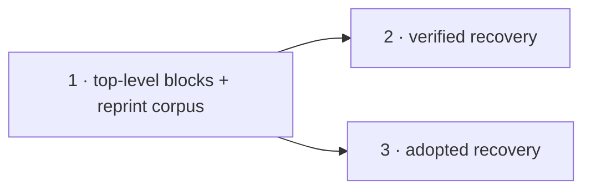

# Domain-enum inference — Plan

**Spec:** [`spec.md`](./spec.md) · **Linear:** none (operator waived tracker integration for this project, consistent with sql-check-constraint-unification)

Three slices. Slice 1 is a prerequisite the other two both need; slices 2 and 3 are the two recovery paths and are independent of each other once slice 1 lands.

## Slices

| # | Slice | Delivers | Status |
| --- | --- | --- | --- |
| 1 | `top-level-blocks-in-inferred-psl` | `contract infer` can emit top-level PSL blocks alongside a namespace-wrapped one, and the reprint corpus is captured against a real database. | ⬜ to spec |
| 2 | `recover-enums-from-derived-checks` | A database Prisma Next migrated round-trips its domain enums: the harvest is hash-verified, and the enum alone re-derives the live check. | ⬜ to spec |
| 3 | `recover-enums-from-adopted-checks` | A never-migrated database pulls its value sets into enums, with the live constraint still declared verbatim and no duplicate derived. | ⬜ to spec |

## Sequencing

Slices 2 and 3 may run in parallel after slice 1. They touch the same function (`buildScalarField` / `buildModel` in `infer-model-blocks.ts`) so they will conflict textually, but neither depends on the other's behaviour — if they run concurrently, the second to land rebases. Running them in sequence is also fine and is the default unless there is a reason to parallelise.

## Why slice 1 is separate

Two things belong to it, both prerequisites rather than deliverables:

**The document can already hold a flat bucket — infer just never emits one.** `PslDocumentAst.namespaces` is an array, `UNSPECIFIED_PSL_NAMESPACE_ID` names the flat bucket, the printer sorts it first (`ast-to-print-document.ts:65-66`) and prints its contents with no wrapper (`serialize-print-document.ts:94-99`). So the fix is not a document-shape change, as first feared: `buildPslDocumentAst` builds exactly one namespace today, and slice 1 makes it build two when there is top-level content. That is a contained change with an existing printer contract to satisfy.

Slice 1 does **not** emit any enum. It proves the seam by moving something that already exists into the flat bucket, or by a print-level test that a two-bucket document renders correctly — whichever the slice spec settles. Nothing about recovery depends on which.

**The reprint corpus is captured first.** `text` with 2+ members is nowhere pinned as a literal, and two `varchar` single-member fixtures in the tree are hand-written and suspect (`schema-verify.verdict.test.ts:791`, `sql-check-constraint-ir.test.ts:67`). Slices 2 and 3 both harvest from these shapes, so the shapes must be observed output before either is written, not after. This is cheap — one integration test that creates each shape and asserts the introspected body — and it protects both downstream slices from being built against a guess.

**Builds on:** current main. **Hands to:** a flat-bucket emitter both recovery slices put enum blocks into, and a verified corpus they harvest from.

## Slice notes

### 2 — `recover-enums-from-derived-checks`

The hash-verified path (spec § Path A). Harvest literals from the reprint, re-render through `postgresRenderCheckExpressions`, hash, compose the wire name, compare to the live constraint name. On a match, emit the enum block and the typed column and nothing else — the membership check's wire name lands in `computeDerivedCheckNames`, and the existing `@@check` emission skips it automatically.

Naming, member-name derivation, codec-id mapping, and the collision policy (spec § Locked decisions 5–8) all land here, because this is the first slice that emits an enum. Slice 3 reuses them.

The negative case is as important as the positive: a wire-*shaped* name whose hash does not verify must recover nothing here and fall through. There is already a real fixture for it — a one-member check created under the fake name `t_role_check_0a1b2c3d` (`check-introspection.integration.test.ts:79-92`).

**Builds on:** slice 1. **Hands to:** the enum-emission machinery and the naming policy slice 3 consumes.

### 3 — `recover-enums-from-adopted-checks`

The exact-named path (spec § Path B). Emit the enum, plus `@noCheck(membership)`, plus the `@@check(map:)` slice 4 of the previous project already emits. Two sub-pieces beyond reusing slice 2's machinery:

- Infer's `@noCheck` emission is gated on `column.many === true` (`infer-model-blocks.ts:324`), so a scalar column cannot currently be waived. The gate is lifted here. Authoring already accepts a membership waiver on any domain-enum column, so this is infer-side only.
- The containment rule (spec § Locked decision 2): a predicate referencing any column other than the one under consideration is not a candidate. Decided by identifier presence, never by predicate structure.

The end-to-end proof lives here: seed a never-migrated database with a hand-written membership check, pull it, and assert the emitted PSL carries the enum, the typed column, the waiver and the `@@check`, and that `db verify --schema-only --strict` is clean immediately with no pending operations.

**Builds on:** slice 1 (and slice 2's naming machinery, or its own copy if 2 has not landed). **Hands to:** project close-out.

## Close-out obligations

- An ADR recording the harvest-decides-the-type-only rule and why it is not the parser ADR 244 rejected. It amends ADR 244's § "Consequences" where that ADR states inference does not recover domain enums.
- The user-facing brownfield story in `skills/prisma-8/references/quickstart.md` and the enum section of `skills/prisma-8/references/contract.md`.
- `projects/sql-check-constraint-unification/spec.md` § Non-goals — its "still open" note about enum-membership inference is closed by this project.
- `projects/domain-enum-inference/` is deleted at close-out per the project lifecycle.
