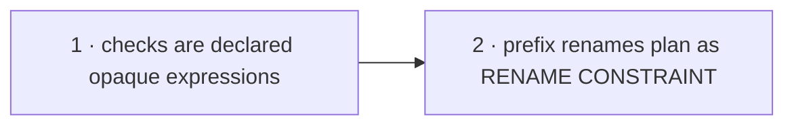

# Unified SQL CHECK constraint representation — Plan

**Spec:** [`spec.md`](./spec.md) · **Linear:** none (operator waived tracker integration for this project)

Each slice is named for what a developer can **rely on** when it merges. The stack is serial: slice 2 pairs wire names that only exist once slice 1 lands.

## Slices

| # | Slice | Delivers | Status | Ticket |
| --- | --- | --- | --- | --- |
| 1 | `checks-are-declared-opaque-expressions` | Every physical CHECK is a contract-declared, wire-named opaque expression; authoring emits enum-membership (scalar and array) and element-non-null checks; introspection captures every live check verbatim; the planner only reconciles — synthesis, the direct-walk strategy, and the predicate parser are deleted. | ✅ merged ([#29892](https://github.com/prisma/prisma/pull/29892)) | — |
| 2 | `check-prefix-renames-plan-as-rename-constraint` | A prefix-only check rename plans as a single `ALTER TABLE … RENAME CONSTRAINT` under `widening`, via hash pairing mirroring `pairIndexRenames`. | ✅ merged ([#29894](https://github.com/prisma/prisma/pull/29894)) | — |

| 3 | `check-enforcement-opt-out` | A per-column, per-kind opt-out (`@noCheck` / `.noCheck()`) for generated checks, and conservative infer emission of it — restoring "pulled schemas verify clean" as the infer default. | ✅ merged ([#29928](https://github.com/prisma/prisma/pull/29928)) | — |
| 4 | `authored-check-constraints` | `@@check` / `check()` declares a hand-written CHECK in the contract — wire-named from an authored prefix, adopted via `map:` by `contract infer` — so a constraint the author added is never dropped as an undeclared extra. | ⬜ specced ([spec](./slices/authored-check-constraints/spec.md)) | — |

## Slice 3 locked decisions (settled with the operator during slice 1 review)

- Generated enforcement checks are derived only for `managed` tables (landed in slice 1's rework as the immediate fix); the opt-out surface generalizes this per column.
- **Opting out of enforcement does not change declared types.** The enum union and non-null element types stand; runtime values may diverge from types once enforcement is waived — that is the user's accepted risk, stated in docs.
- Infer emission is conservative by necessity (opaque introspection cannot classify live predicates): the enforced form is emitted only when a live check's name matches the derived wire name; otherwise the unenforced form, with any hand-written check surfacing separately.
- Interim until slice 3 lands: infer fidelity asserts convergence (pulled schema → one additive plan → clean), not immediate cleanliness.

## Sequencing

- **Slice 1 first.** It is the hard cut: the contract shape change forces authoring, schema IR, introspection, and planner to move in the same PR (the old value-set path cannot coexist with complete introspection — the current planner would start dropping newly visible constraints). Splitting further would ship transitional shims the next PR deletes.
- **Slice 2 second, not parallel.** Its pairing pass consumes wire-named check nodes on both diff sides, which exist only after slice 1. Until it lands, a prefix-only change plans as drop + add — correct, just destructive-requiring; that interim behavior is acceptable and tested in slice 1.

## Per-slice notes

### 1 — `checks-are-declared-opaque-expressions`

The substrate hard-cut, one concept end-to-end (the sandwich shape: contract/IR → authoring/emitter → adapter/planner):

- Contract IR `CheckConstraint` → `{ name, prefix?, expression }`, arktype wire schema, canonical sort by physical name, check content hash beside `computeIndexContentHash` in `naming.ts`.
- Duck-typed Postgres authoring hook (beside the `qualifyColumnType` precedent) renders expressions at emit time: scalar enum `IN`, array enum `<@ ARRAY[…]::text[]` (fixes the latent array-enum DDL bug — currently unplannable SQL, zero integration coverage), `array_position(…) IS NULL` for every `many` column. `ENUM_INVALID` moves to render time.
- `SqlCheckConstraintIR` → `{ name, prefix?, expression }` with index-style equality; the `valueDrift` classification branch is removed.
- Introspection: `pg_get_expr(c.conbin, c.conrelid)` + `AND c.conislocal` + `AND c.conrelid <> 0`; `parseCheckConstraintDef` deleted; bodies stored verbatim; naming via `namingOfLiveName`.
- Planner: `checkConstraintPlanCallStrategy`, `elementNonNullCheck*`, `isManyColumn` deleted; `mapCheckNodeIssue` handles `not-found` → add, `not-expected` → drop, `not-equal` → conflict; `AddCheckConstraintCall` takes `expression`; CREATE TABLE renders checks inline from the table node's children.
- Lifecycle integration suite (templates: `rls-lifecycle-e2e`, `rls-introspection`): create, introspect-raw-SQL, no-drift (incl. `varchar` reprint shape), expression change → drop/add, add-list-column installs its check, manual constraint loss repaired, adoption of old-model unsuffixed names converges via drop + add, multi-namespace independence, array-enum element rejection (out-of-set and NULL element `INSERT`s fail).
- Rides along per doc-maintenance rules: stale `verifyCheckConstraints` doc references removed; [contract-free-migration-planning/plan.md](../contract-free-migration-planning/plan.md) updated to record the strategy deletion delivered here.

Slice-INVEST note: this is large but single-outcome — "one representation everywhere, planner only reconciles." The reviewer reads one concept across layers, not unrelated changes. Fixture regen is expected (contract shape change).

**Builds on:** current main. **Hands to:** wire-named check nodes on both diff sides; diff-driven check planning; the adoption drop+add path as tested interim behavior for renames.

### 2 — `check-prefix-renames-plan-as-rename-constraint`

- `RenameCheckConstraintCall` (`widening`) + `renameCheckConstraint` DDL op (raw-SQL style of the constraint family; prechecks old-present + new-absent from `constraintExistsAst`, postcheck new-present), registered in the op union, migration class, `classifyCall` bucket, export barrel.
- `pairCheckRenames` planner post-pass cloned from `pairIndexRenames` **pass 1 only** (wire-hash pairing per `(schema, table, hash)`, sorted deterministic, requires `widening`, consumes both issues). No content/adoption pass — spec locks drop + add for exact-named live checks.
- Unit tests mirroring `index-rename-planner.test.ts`; integration test: prefix-only PSL rename plans exactly one `RENAME CONSTRAINT` and verifies clean after apply.

**Builds on:** slice 1. **Hands to:** project close-out.

## Close-out obligations (tracked here so no slice forgets them)

- The project ADR (spec § ADR pointer) — **Check constraints are opaque wire-named expressions** — is authored at close-out and extends ADR 234.
- The migration-system subsystem doc gains the unified-check section; `projects/sql-check-constraint-unification/` is deleted per the project lifecycle.
